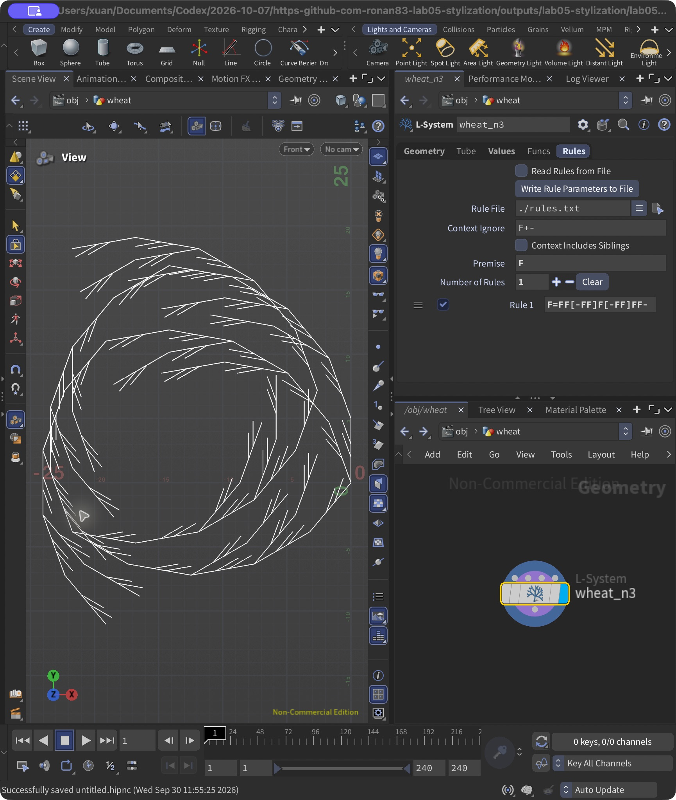
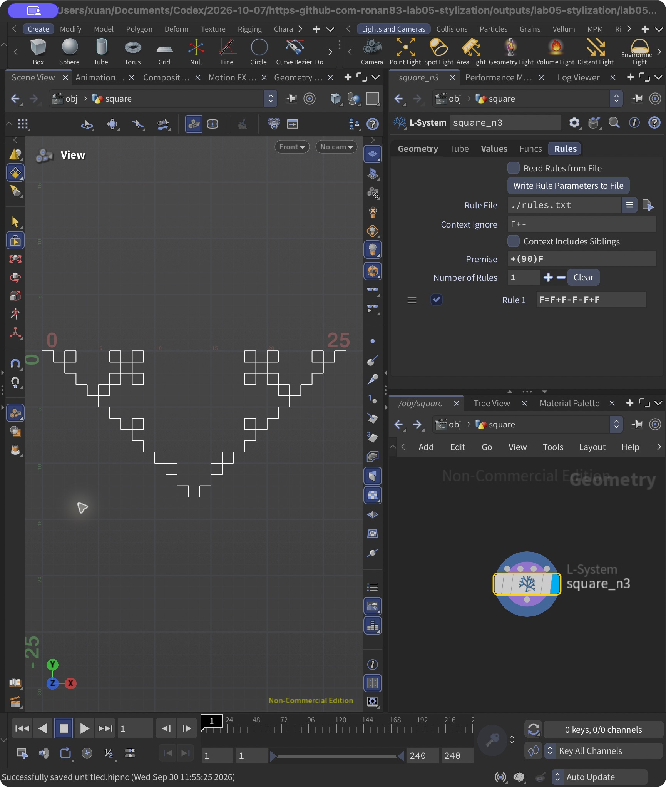

# Lab 05 — L-systems

The Houdini file is [lab05.hipnc](lab05.hipnc). It contains three geometry objects: `wheat`, `square`, and `fern`. Each object has separate L-system nodes for the iterations shown below.

## 1. Wheat grammar

```text
Premise: F
Angle: 20 degrees
Rule: F=FF[-FF]F[-FF]FF-
```

The main stem has five forward steps. The two `[-FF]` branches leave the stem at different heights, and the brackets return the turtle to the stem after each branch. The last `-` changes the heading for the next section. It does not change the first iteration's visible stem, but it makes the later iterations bend and curl.

### Rules in Houdini



### Iterations 1, 2, and 3


## 2. Square grammar

```text
Premise: +(90)F
Angle: 90 degrees
Rule: F=F+F-F-F+F
```

The initial `+(90)` points the turtle to the right. Each `F` becomes five segments: right, down, right, up, and right, relative to the starting heading. Replacing every segment again produces the smaller square loops in the second and third iterations.

### Rules in Houdini



### Iterations 1, 2, and 3


## 3. Custom plant — fern

The reference is a lady fern. The structure I focused on is the central stalk, the side branches on both sides, and the smaller leaflets along those branches. This is a simplified flat frond; the individual leaflets have straight edges instead of the small lobes in the photo.


Reference photo: [Rosser1954, Lady Fern frond — normal appearance](https://commons.wikimedia.org/wiki/File:Lady_Fern_frond_-_normal_appearance.jpg), [CC BY-SA 3.0](https://creativecommons.org/licenses/by-sa/3.0/). The photo is included unchanged.

### Grammar

```text
Premise: F(0.8)A(0.65)
Angle: 20 degrees

A(l)=F(l)[-(65)B(l*.95)][+(62)B(l*.9)]-(2)A(l*.9)
B(l)=F(l*.18)D(l)F(l*.18)D(l*.9)F(l*.18)B(l*.78)
C(l)=[{.+(12)f(l/2).-(24)f(l/2).-(156)f(l/2).-(24)f(l/2).}]
D(l)=[-(60)C(l*.55)][+(60)C(l*.5)]
```

- **A** grows one section of the central stalk and starts a branch on each side. The next section is 90% as long, so the frond tapers toward its tip. The two branch angles and lengths are slightly different, and the stalk bends by 2 degrees per section.
- **B** grows a side branch. It adds two pairs of leaflets and then continues with a shorter branch segment. The `0.78` factor makes the outer parts smaller.
- **C** draws one narrow leaflet. The braces start and end a polygon, the dots record its corners, and lowercase `f` moves between corners without adding stem lines. Its brackets keep the leaf from changing the branch's position or heading.
- **D** places a leaflet on each side of a branch. Keeping this pair in its own rule lets the same arrangement be reused twice in **B**.

Here, `l` is the length passed into each symbol. The rules are applied together once per generation, so a new `B` takes another generation to produce `D`, and `D` takes another generation to produce the leaf polygon through `C`. This is why the youngest branches near the tip still have no leaves.

### Iterations 3, 5, and 7

At iteration 3, the stalk and side branches are visible. At iteration 5, the older branches have leaflets. At iteration 7, there are more rows of branches and more leaflets on the lower branches.


The three iteration diagrams use the actual geometry generated by the Houdini nodes, arranged side by side for comparison. Each view is fitted separately; green is used in the fern diagram to make the leaf polygons easier to see.


## Opening the project

Open `lab05.hipnc` in Houdini. The file opens on `fern_n7`. To inspect a different result, enter its geometry object, select the desired L-system node, and turn on its blue display flag. The number at the end of each node name is its generation count.

All nodes use **Skeleton** output and **Random Scale = 0**. The puzzle nodes use **Step Size = 1**. The fern uses explicit segment lengths in its rules. The results were checked in Houdini Apprentice 22.0.429; the project is saved as a non-commercial `.hipnc` file.
