# Lab 05 - Grammars

Everything is in `lab05_grammars.hipnc` (Houdini 22.0.466, Apprentice). There are three geo nodes in `/obj`: `wheat`, `square` and `lady_fern`, each with an L-System SOP and a Color SOP after it so the lines show up black in the viewport (and so the fern's leaves can be colored separately from the stems).

A couple of Houdini conventions that matter for reading the rules below: the turtle starts pointing +Y, `+` turns **right** and `-` turns **left** (the opposite of the textbook convention), `&` / `^` pitch down / up, `/` rolls, and `"` multiplies the step size.

## 1. Wheat grammar puzzle

| Premise | Rule 1 | Angle |
|:--|:--|:--|
| `F` | `F=FF[-FF]F[-FF]FF-` | 20 |

| n = 1 | n = 2 | n = 3 |
|:--:|:--:|:--:|
| 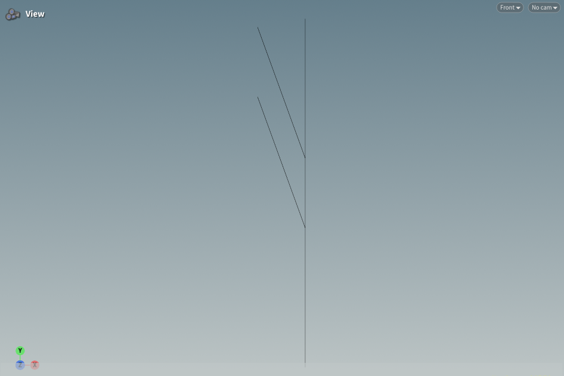 | 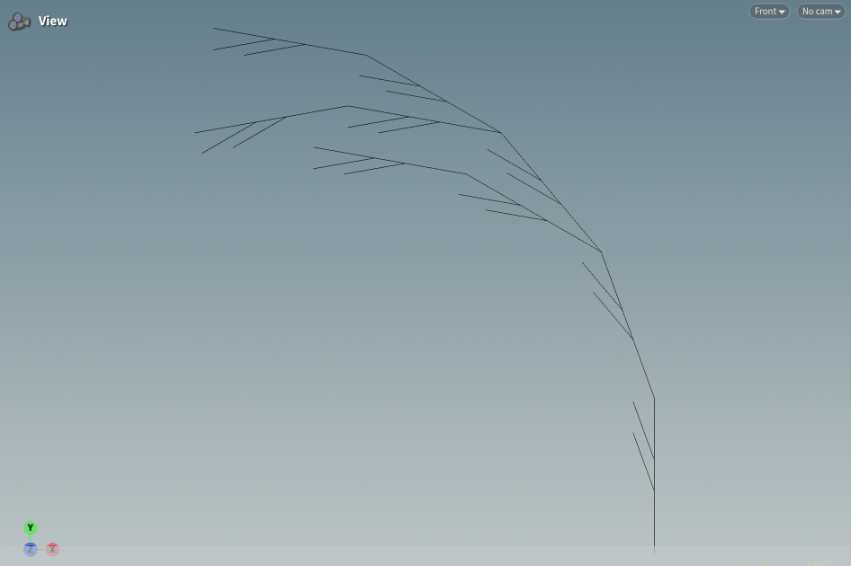 | 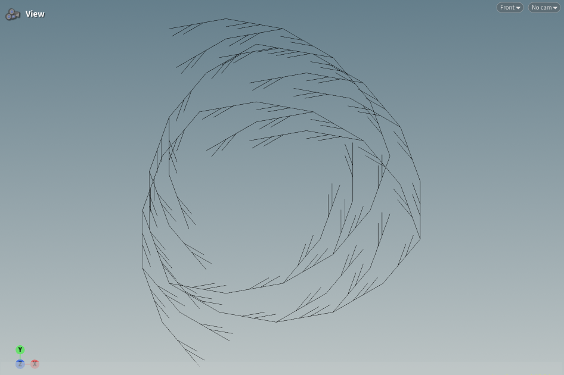 |

How I got there: the n = 1 picture is just one straight stem with two branches, and both branches lean 20° to the left, so that pins down the angle. Measuring the picture, the two branches sit at 2/5 and 3/5 of the way up the stem and are 2 units long, so one rewrite of `F` has to be `FF[-FF]F[-FF]FF`. The giveaway for the turn is n = 2: the stem is no longer straight but made of segments that each turn 20° to the left, and every one of those segments looks exactly like the n = 1 picture shrunk down (two little branches at 2/5 and 3/5). So the turn has to be part of the rule and it has to come *after* the stem, otherwise the n = 1 stem would already be tilted. With 25 segments at n = 3 the stem turns 500° in total, which is why it curls into that spiral.

## 2. Square grammar puzzle

| Premise | Rule 1 | Angle |
|:--|:--|:--|
| `+F` | `F=F+F-F-F+F` | 90 |

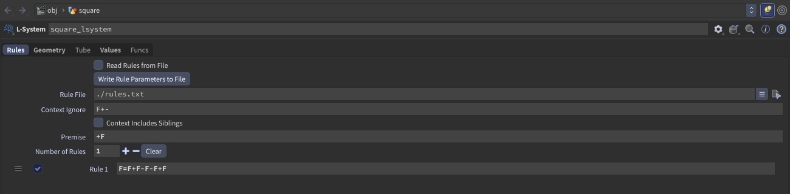

| n = 1 | n = 2 | n = 3 |
|:--:|:--:|:--:|
| 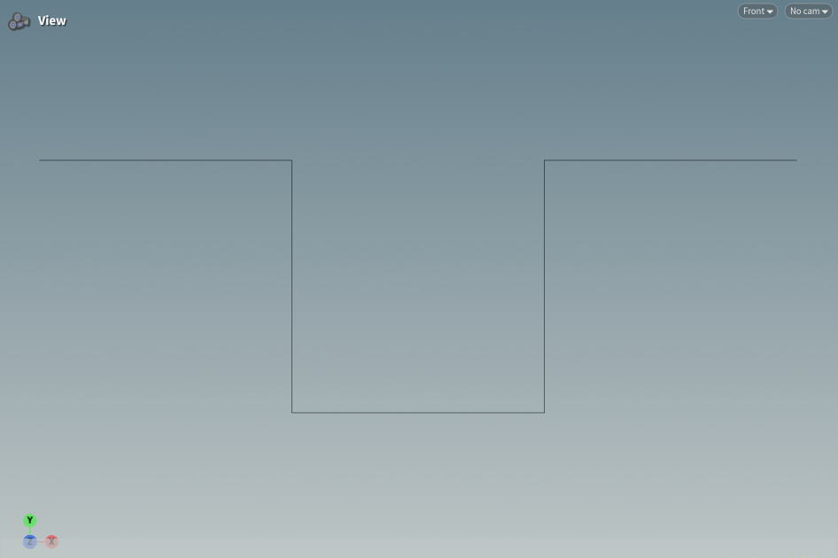 | 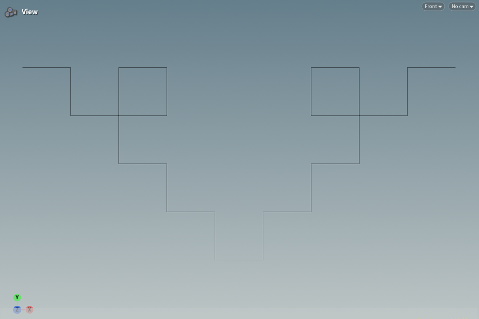 | 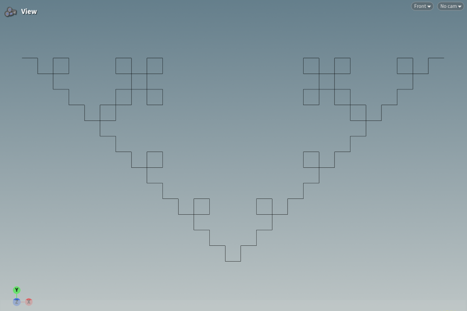 |

This one is a quadratic Koch curve. n = 1 is five equal segments: forward, turn right (down), forward, turn left, forward, turn left (up), forward, turn right, forward. The `+` in the premise is only there to make the turtle start pointing to the right instead of up, so the picture comes out horizontal like the reference. I checked n = 2 by hand before building it: the second `F` (the one pointing down) gets its own notch which pokes out to the *left* of the path, and that's where the little square that the path crosses itself in comes from. The premise turn isn't rewritten so it doesn't mess anything up at higher n.

## 3. Custom plant: lady fern

I went with a lady fern (*Athyrium filix-femina*). I liked it because it has three clear levels of structure, which is a good fit for a grammar with several rules:

- a **crown** at the base that sends out fronds in a rosette,
- each **frond** has a central stalk (the rachis) that arches over, with **pinnae** coming off it alternately left and right,
- each pinna carries a row of small **leaflets** (pinnules) on both sides,
- and young fronds start as a tightly curled **fiddlehead** that unrolls as the frond grows. The frond also tapers: the pinnae near the base are long and the ones near the tip are tiny.

Reference I was looking at: [lady fern on Wikipedia](https://en.wikipedia.org/wiki/Athyrium_filix-femina).

### The grammar

| Premise | Angle | Type |
|:--|:--|:--|
| `K` | 60 | Tube, thickness 0.028 |

| | Rule | What it does |
|:--|:--|:--|
| 1 | `K=[&(20)AC]/(137.5)M` | **Crown.** Every generation the crown pushes out one new frond: pitch it over by 20°, start a frond apex `A` with a fiddlehead `C` on its tip, then roll by 137.5° (the golden angle, so fronds never line up on top of each other) and become `M`. |
| 2 | `M=[&(45)AC]/(137.5)K` | Same as rule 1 but the frond leans 45° instead of 20°, and it turns back into `K`. The two rules alternate, so the rosette gets a mix of upright and flopped-over fronds instead of all of them looking the same. |
| 3 | `A=F!(0.95)"(0.93)&(3)[-"(0.5)B]F!(0.95)"(0.93)&(3)[+"(0.5)B]A` | **Frond apex / rachis.** Each generation the apex grows two rachis segments. After each one the stalk gets a bit thinner (`!`), the step gets a bit shorter (`"`) and the heading pitches down 3°, which is what makes the frond arch. One pinna `B` is spawned on the left of the first segment and on the right of the second, at half the current step size, so pinnae alternate sides. The `A` at the end keeps the frond growing. |
| 4 | `B=F"(0.85)[-(50)L][+(50)L]B` | **Pinna.** Grows one segment per generation, shrinking by 0.85 each time so it can't get longer than a few steps, and puts a leaflet `L` on each side at 50°. |
| 5 | `L="(1.2)g(1){.-(20)f.+(40)f.+(140)f.}` | **Leaflet.** A little rhombus polygon pointing along the pinna, drawn with Houdini's `{ . }` polygon commands. `g(1)` drops it into primitive group `lsys1`, which is what the second Color SOP uses to paint only the leaves green. |
| 6 | `C=^(40)"(0.8)F^(40)"(0.8)F^(40)"(0.8)F^(40)"(0.8)F^(40)"(0.8)F^(40)F` | **Fiddlehead.** Six short segments that each pitch up 40° and shrink, so they curl 240° back on themselves. `C` always sits after the `A` in the string, so as the apex inserts new rachis segments the curl stays on the very tip of the frond. |

Things I found out while building it:

- The step scaling is what gives the frond its shape. Because every rachis segment multiplies the step by 0.93 and each pinna starts at half the rachis step, pinnae spawned near the tip are automatically shorter, and old pinnae at the base have had more generations to grow. Together that gives the long-at-the-base, short-at-the-tip profile.
- I first tried the `T` tropism command for the arching but couldn't get it to visibly bend anything no matter what I put in the Gravity parameter, so I switched to a constant `&(3)` pitch per segment, which is easier to reason about anyway.
- Because the crown adds exactly one frond per generation and the frond rule is the same for all of them, the plant's "age" is baked into the grammar: at low generations you just get a single fiddlehead, then a frond with a couple of bare pinnae, and the full rosette only shows up around 8-10 generations. That matches how a real fern unrolls new fronds from the middle.

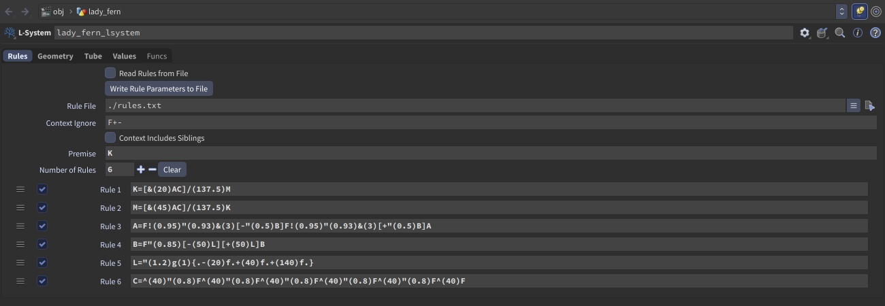

### Iterations

| n = 2 | n = 3 | n = 5 |
|:--:|:--:|:--:|
| 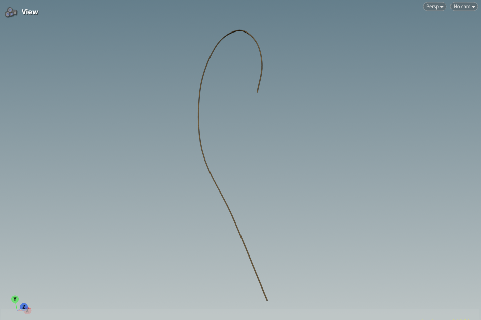 | 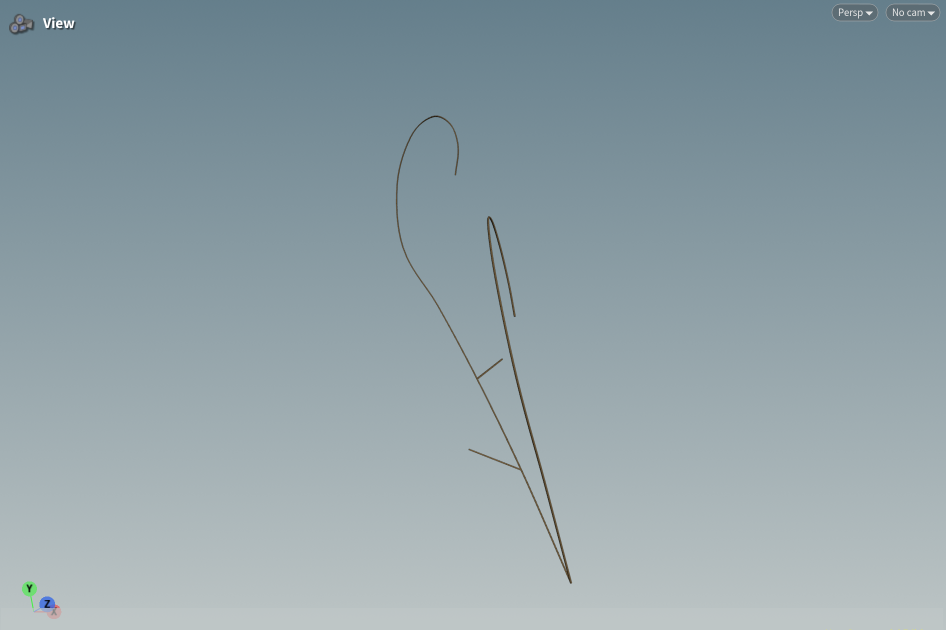 | 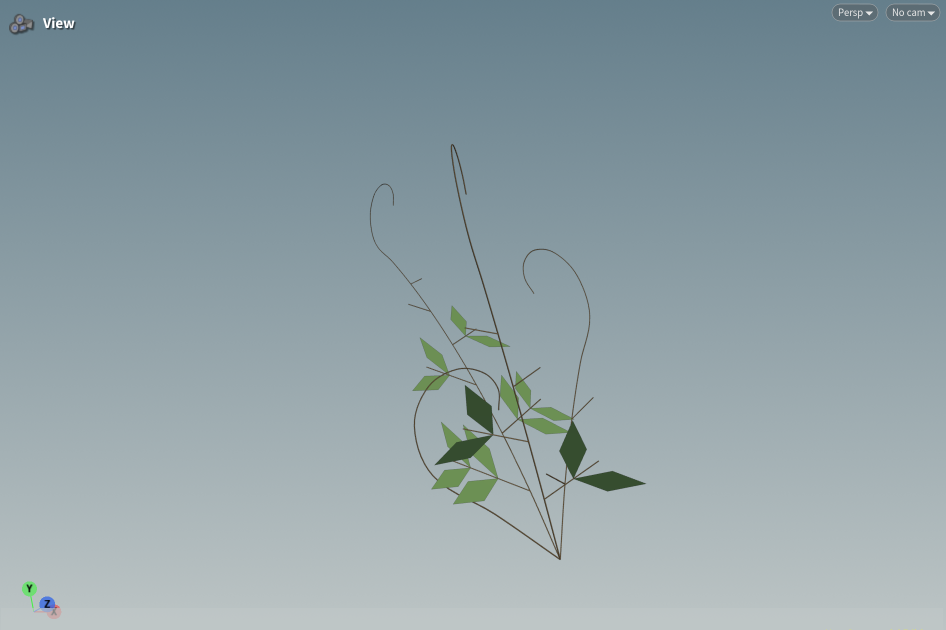 |

| n = 7 | n = 10 |
|:--:|:--:|
| 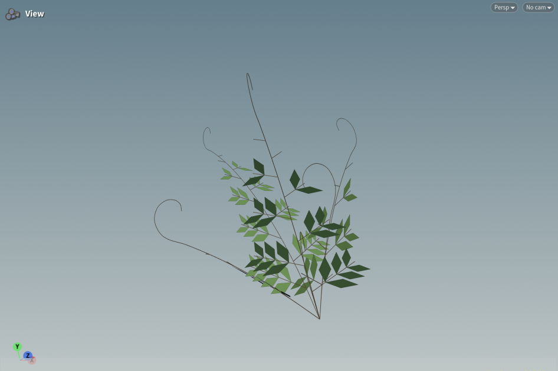 | 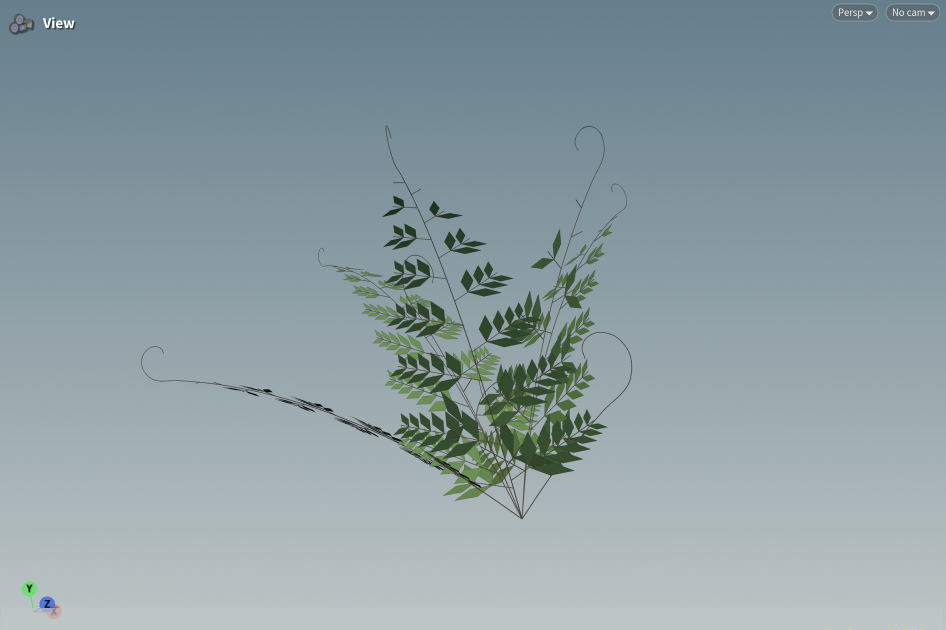 |

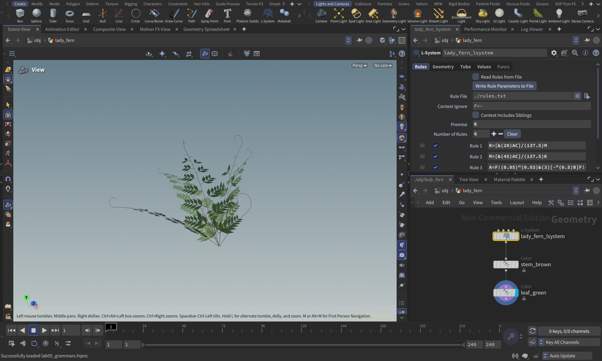

---

## Original instructions

# lab05-grammars
Let's practice using grammars! For this lab, please pull up the L-system node in Houdini.

## 1. Wheat grammar puzzle
Look at these iterations (n = 1, 2, 3) of a one-rule grammar. Using the built in symbols in Houdini, design a grammar that produces this output. Take a screenshot of your rules.\

## 2. Square grammar puzzle
How about this one? Take a screenshot of your rules.\

## 3. Custom plant
Choose a plant in the world. Working off a reference, design a grammar that mimics the structure of that plant. Unlike our simple puzzles, please use multiple rules for greater complexity. Think carefully about the structure of your grammar! EXPLAIN the structure of your plant in the README. What are the components? What do each of the rules do? Be sure to also include images of a few iterations of your output plant. 

## Submission
- Create a pull request against this repository
- In your readme, list your solutions and format your README nicely
- Profit
