# Lab 05 – L-System Grammars

Made with the L-System SOP in Houdini 21.0.

## 1. Wheat Grammar Puzzle

- Premise: `F`
- Rule: `F=FF[+FF]F[+FF]FF+`
- Angle: `20`

The trailing `+` isn't visible at n = 1. From n = 2 on, every rewritten segment ends with a turn, so the stem curls.

| n = 1 | n = 2 | n = 3 |
|:---:|:---:|:---:|
| 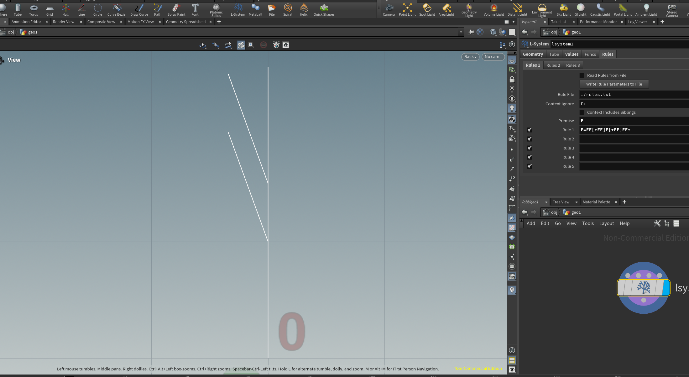 | 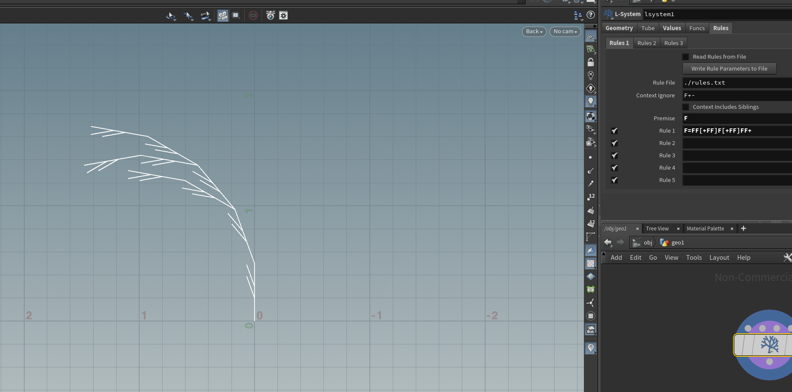 | 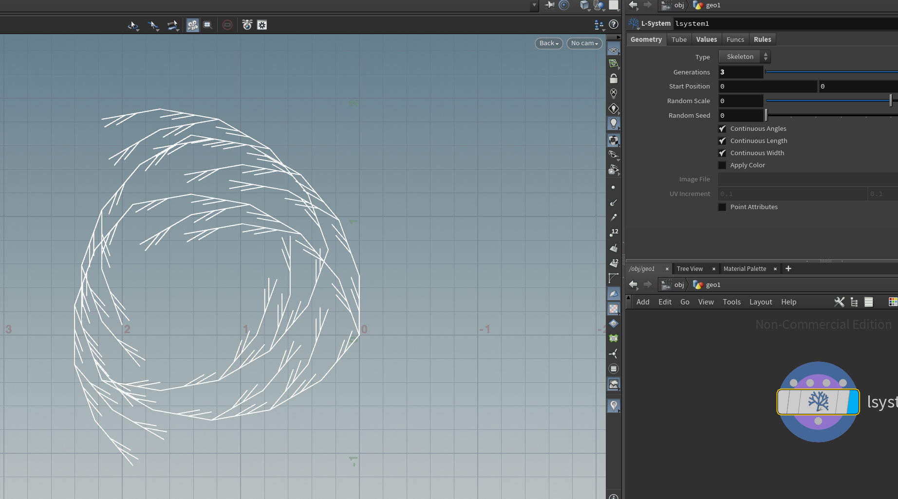 |

## 2. Square Grammar Puzzle

- Premise: `+F`
- Rule: `F=F+F-F-F+F`
- Angle: `90`

Each segment is replaced by a square notch.

| n = 1 | n = 2 | n = 3 |
|:---:|:---:|:---:|
| 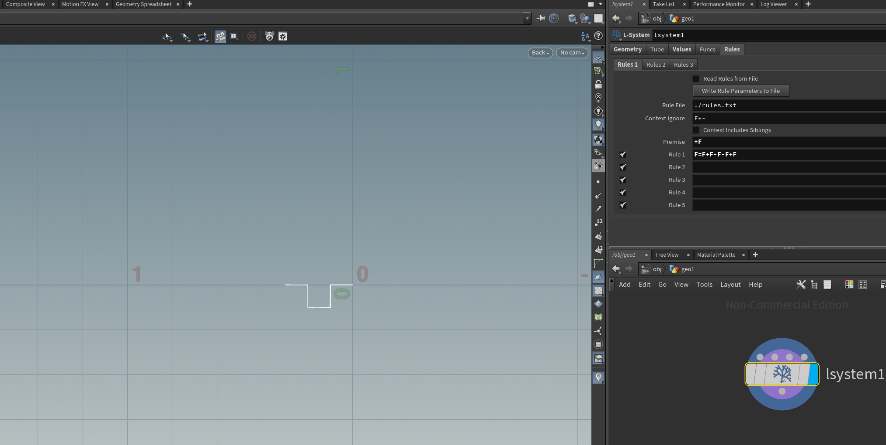 | 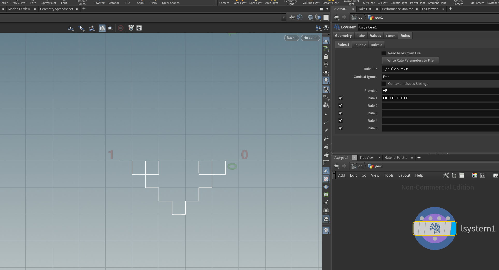 | 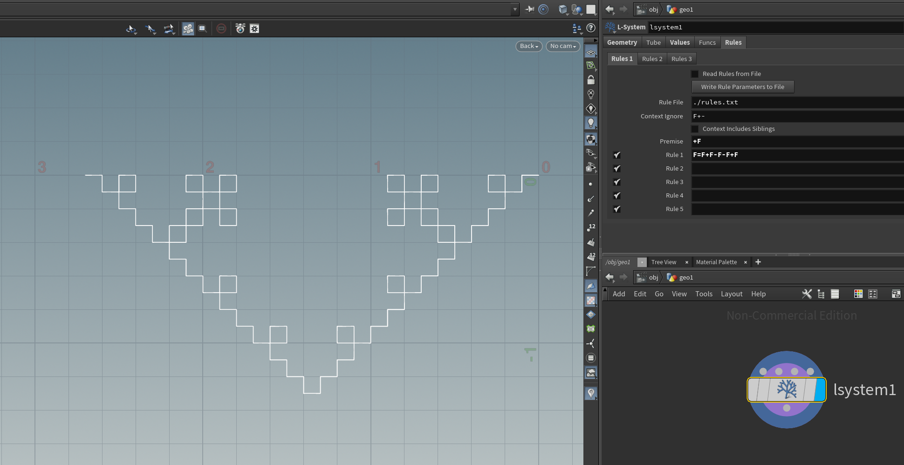 |

## 3. Custom Plant – Cherry Blossom Tree

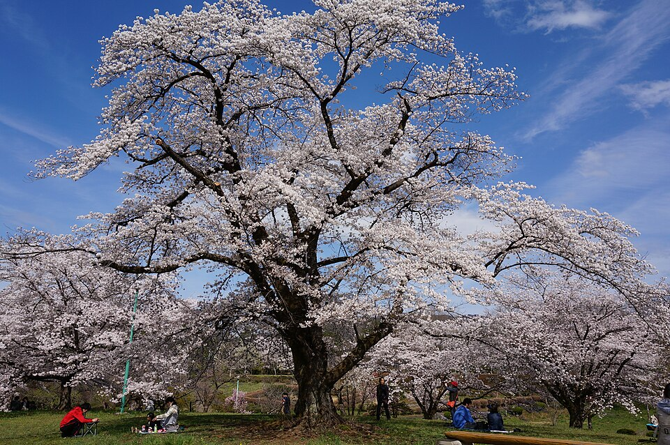

*Reference: "Yoshino cherry ソメイヨシノ" by SLIMHANNYA, [Wikimedia Commons](https://commons.wikimedia.org/wiki/File:Yoshino_cherry_ソメイヨシノ.jpg), CC BY-SA 4.0.*

A cherry tree has a short trunk that splits into about three limbs. The limbs keep forking into a wide, slightly drooping crown, with clusters of flowers along the twigs.

```
Premise: FA
A=[&B]////[&B]////[&B]
B=!"TF[+B]///[-B]F[C]J
C=[&FJ][^FJ]
```
Angle `35`, Step Size Scale `0.75`, Gravity `0.2`. `J` copies a small pink sphere.

| Rule | Component | What it does |
|---|---|---|
| `FA` | Trunk | One trunk segment, then the fork `A` |
| `A` | Fork | Splits into 3 limbs spaced evenly around the trunk |
| `B` | Branch | Gets thinner and shorter, droops a little (`T`), and forks into two `B`s in different planes. Adds a flower cluster `C` along the branch and a blossom `J` at the end |
| `C` | Flower cluster | Two short stalks, each with a blossom |

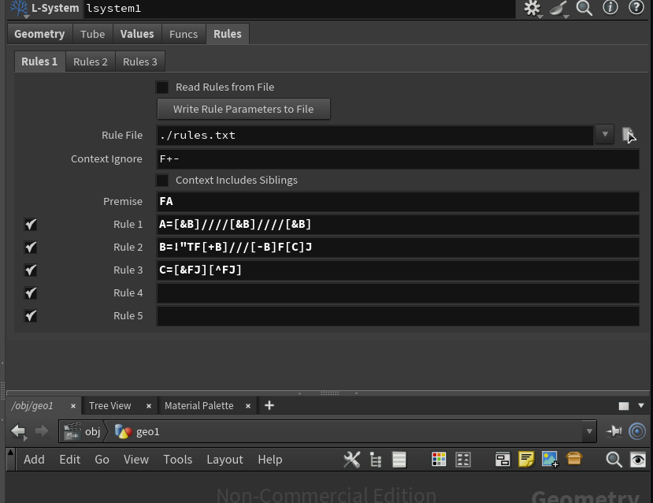 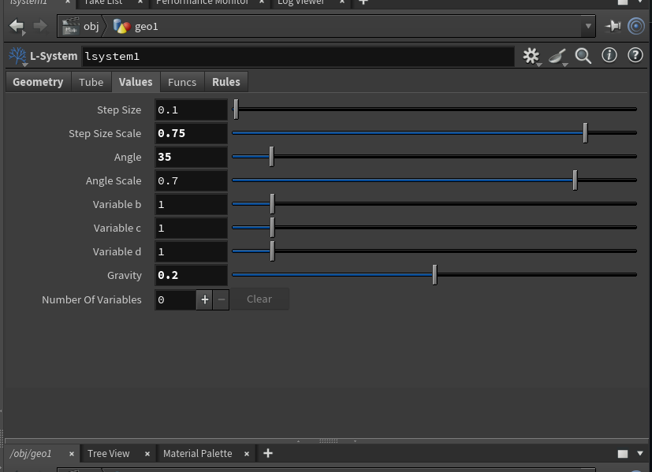

| n = 2 | n = 3 | n = 4 |
|:---:|:---:|:---:|
| 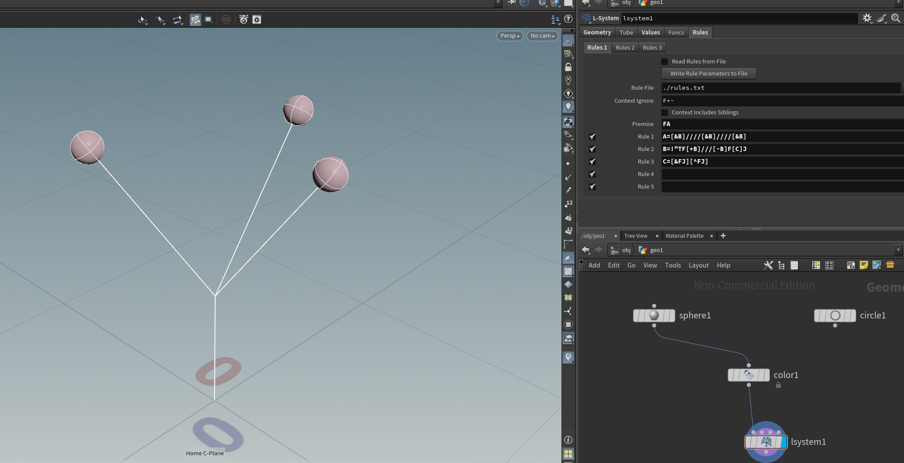 | 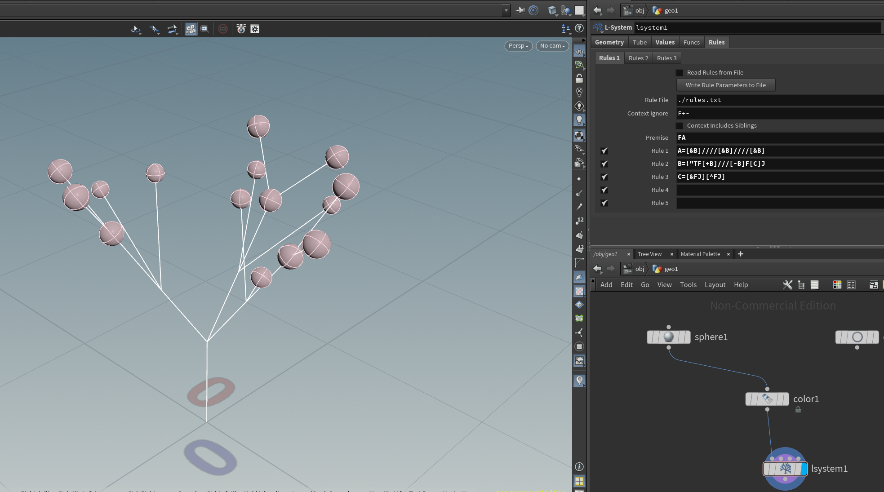 | 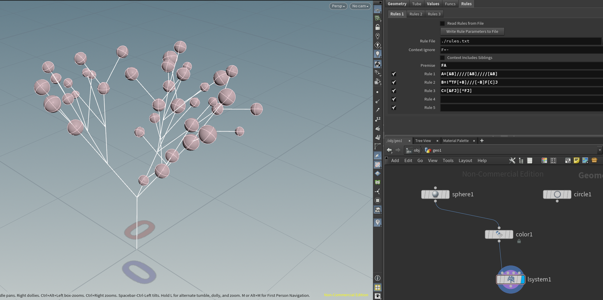 |

| n = 5 | n = 6 |
|:---:|:---:|
| 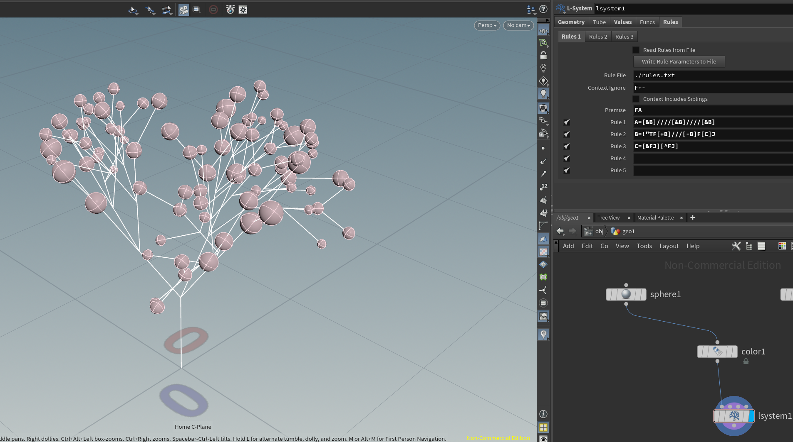 | 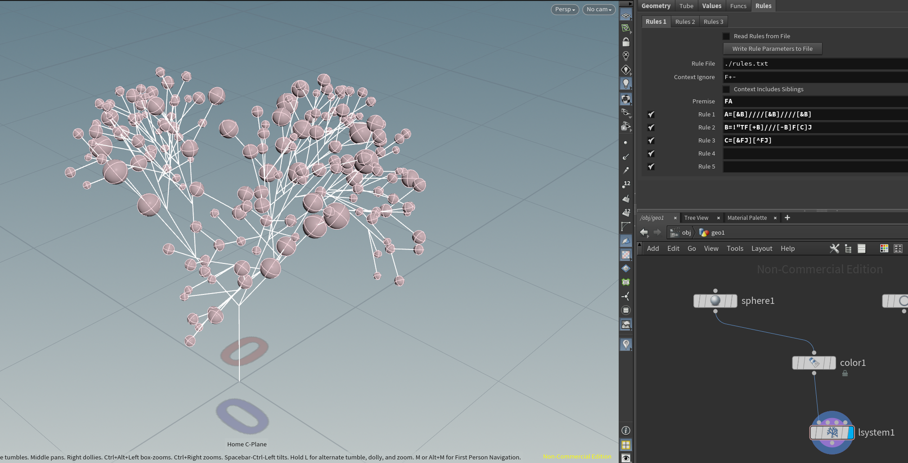 |
