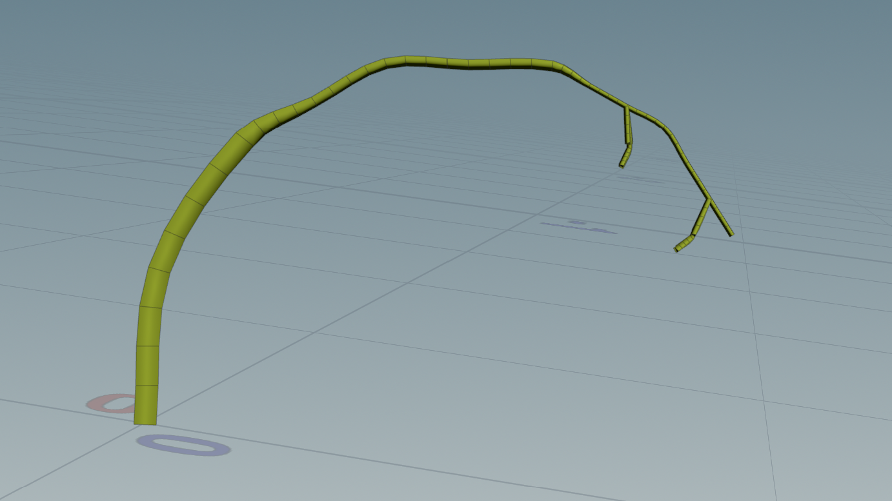
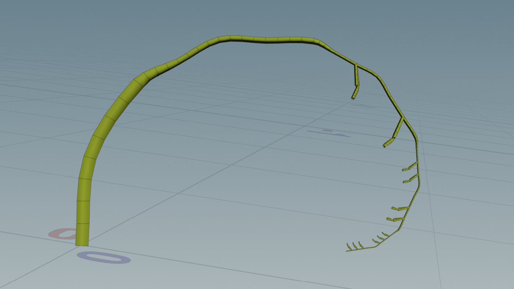
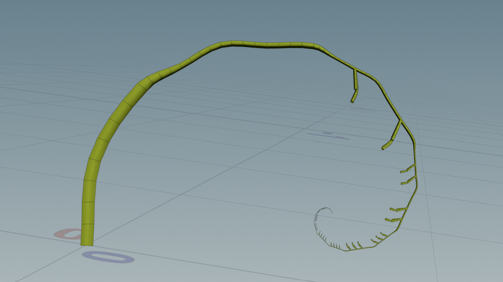

# lab05-grammars
The lab instructions can be found [here](https://github.com/CIS-5660-Fall-2026/lab05-stylization/blob/main/README.md).

## 1. Wheat Grammar
For this L-system, the angle is set to `20`

## 2. Square Grammar
For this L-system, the angle is set to `90`

## 3. Custom Plant
At Nico's suggestion, I chose to try and model a fern. Specifically, the fiddlehead fern.

*(The above image is from the [Natural History Museum](https://www.nhm.ac.uk/discover/ferns.html))*

I used [this spiral L-system](https://gist.github.com/nitaku/8b9e134ca8bae13bb470) as a base for the fern; then, with Nico's help, I injected "leaves" at junctures.

1. `A=AF[+C]` - This adds growth to the spiral, and produces a leaf at each juncture where it occurs (there is an area of empty "stem" as it takes 3 iterations for `C` to be invoked).
2. `B=B!(0.5)"(0.5)+AF+AF`- This is where the "spiraling" happens: first, the incoming geometry is scaled down both by length and (volume) thickness. Then, it is extended twice by `AF` (i.e., the rule `A` and then moved forward once).
3. `C=[+^F][+&F]+F"(0.5)[+^F][+&F]` - This is the "geometry" for the "leaf": it makes a three-prong fork, then from the center branch makes another, scaled down three-prong fork.

*(Screenshots of the L-system with 3, 5, and 10 iterations, respectively)*