# lab05-grammars

Let's practice using grammars! For this lab, please pull up the L-system node in Houdini.

## 1. Wheat grammar puzzle

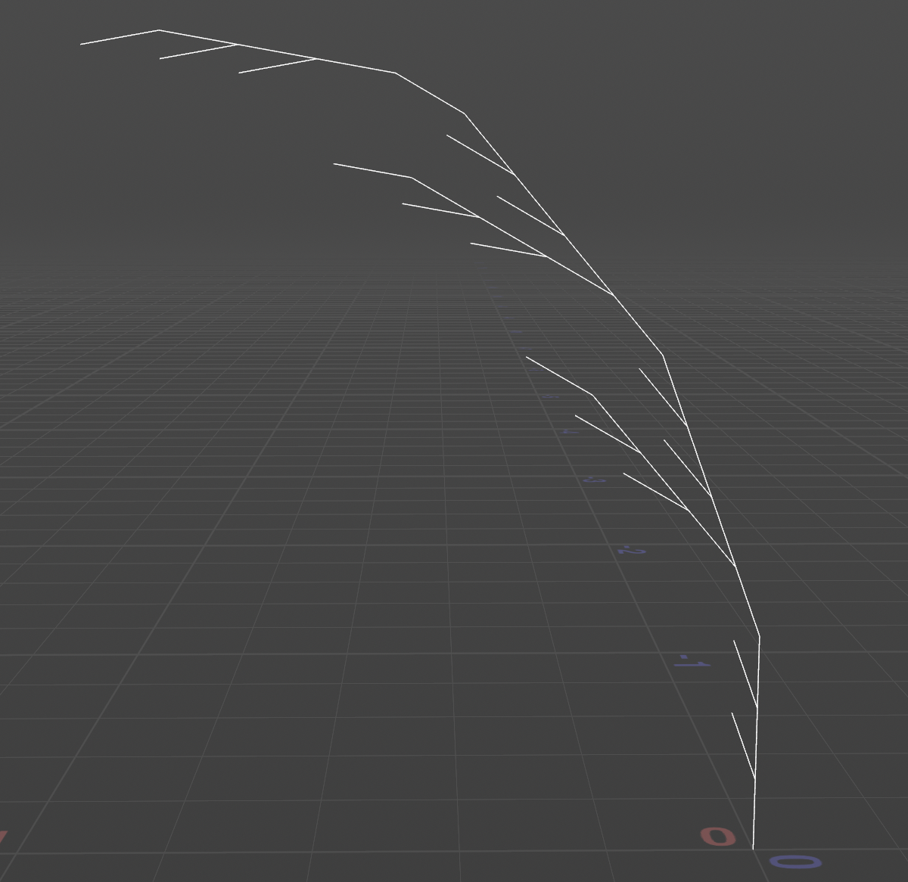
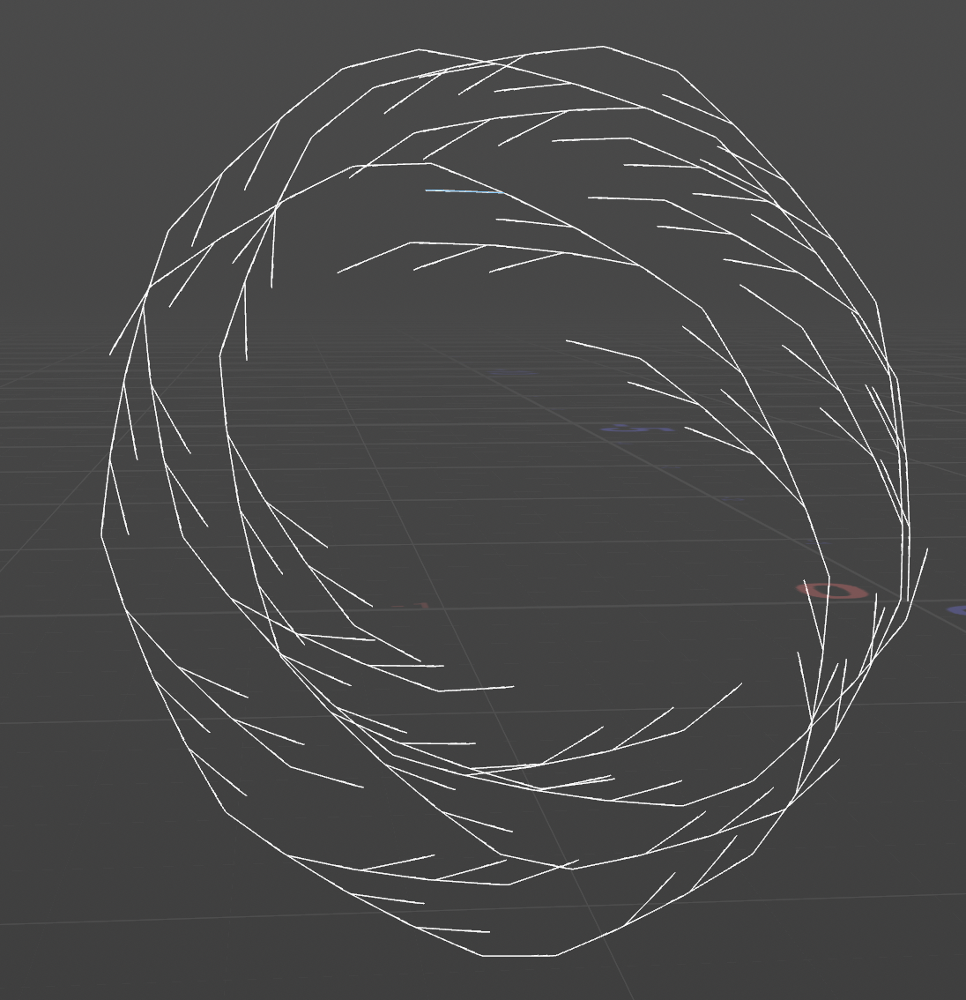
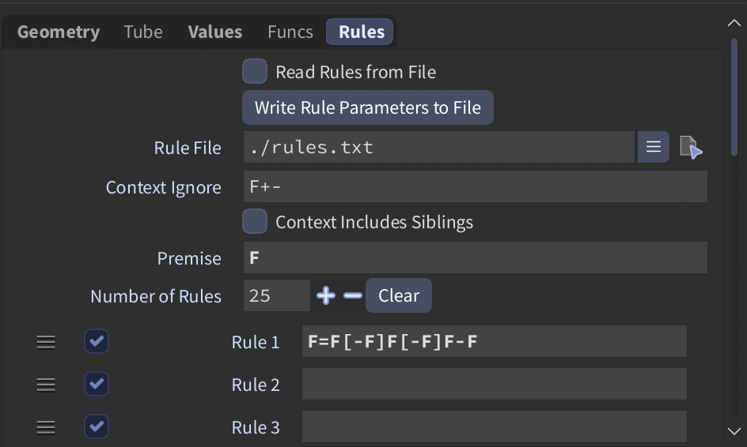

Set angle in `values` tab to 20.

## 2. Square grammar puzzle

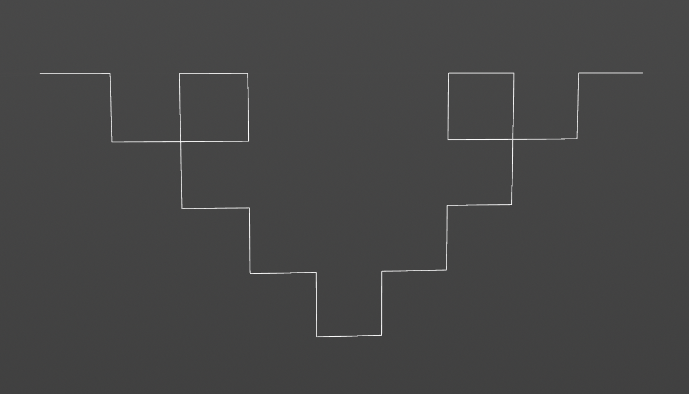
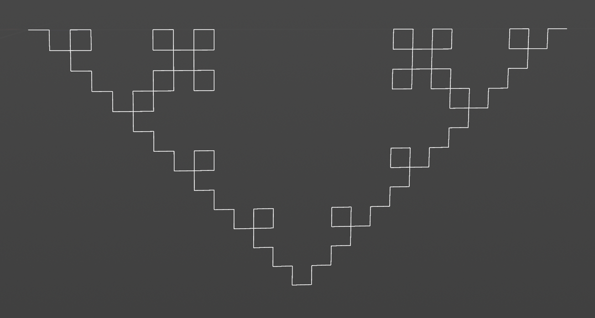
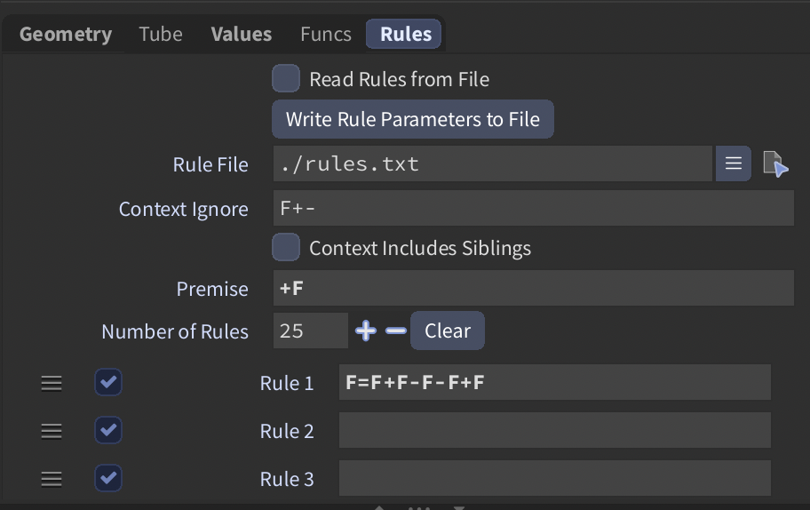

Set angle in `values` tab to 90.

## 3. Custom plant

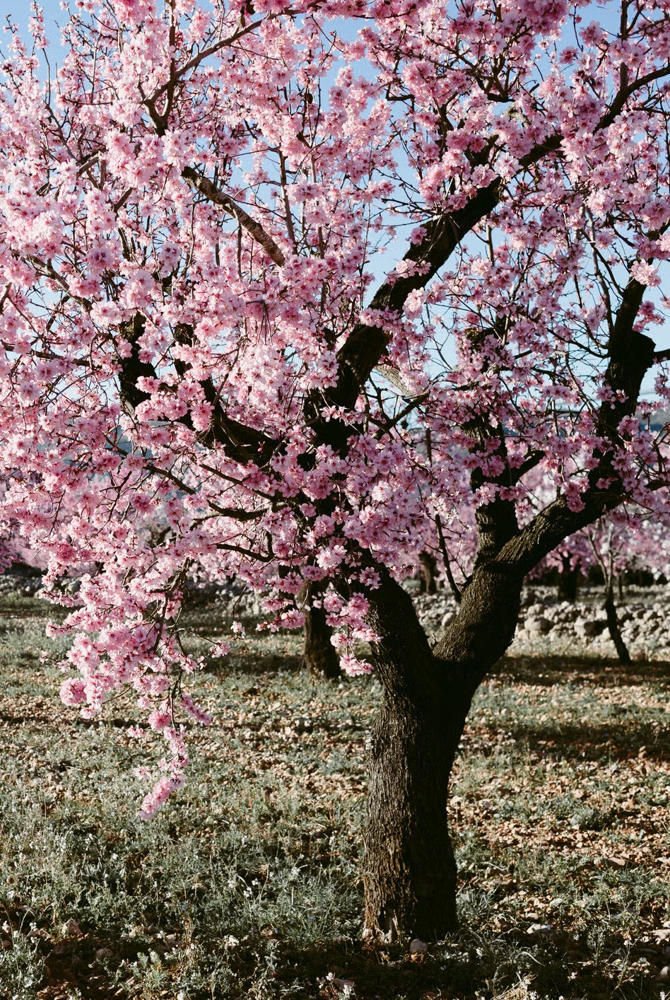
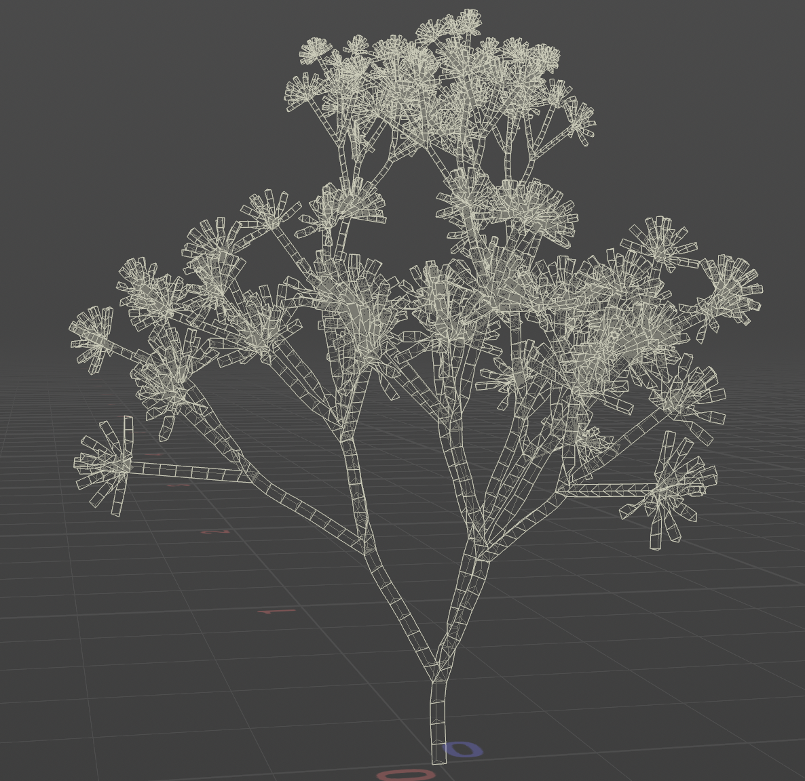
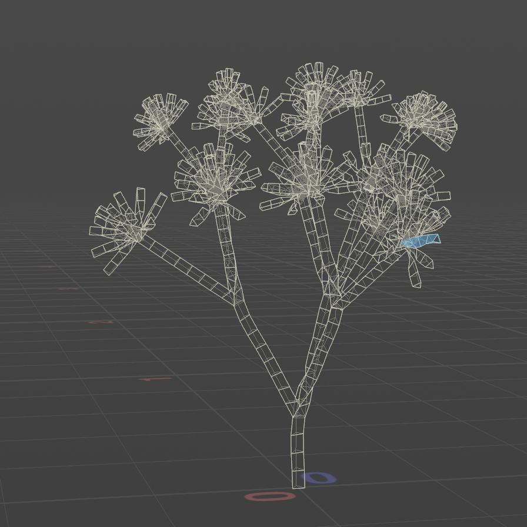
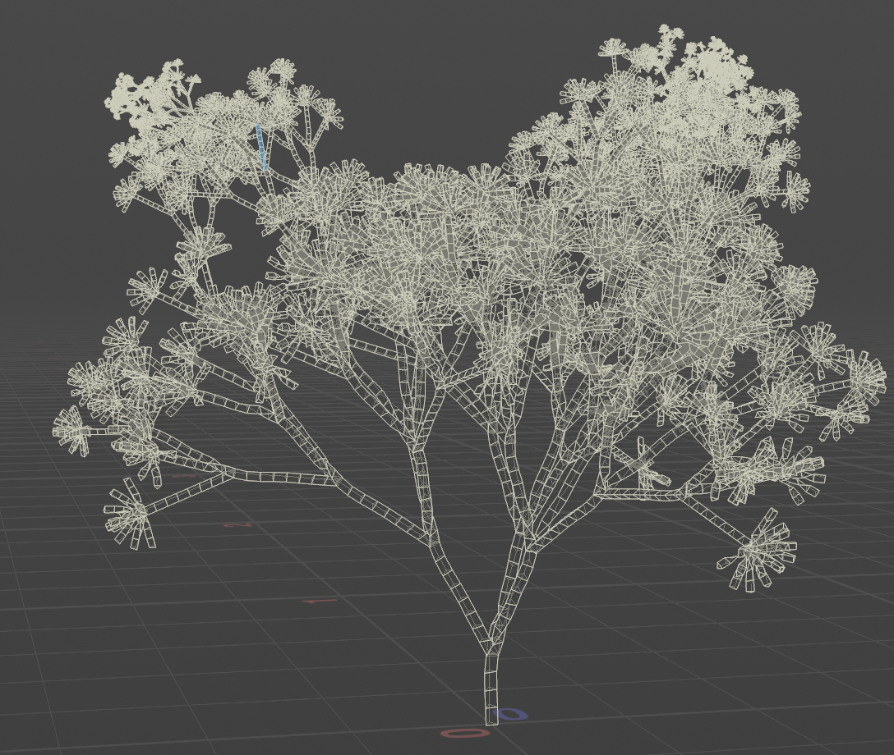
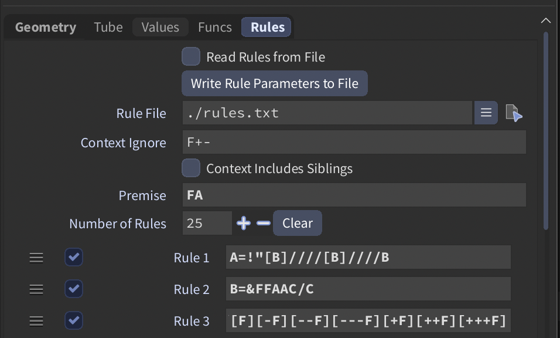

This takes the standard Houdini L-System which creates trees then places a custom symbol on the end points to represent flower like structures. Each time the custom symbol is encountered, a flower will spawn on the end.
