# Lab 5: L-System Grammars

**Yao Tang**

I used the L-System node in Houdini Apprentice 22.0.466 to make the two puzzle patterns and a custom fern. The screenshots below show the rules and results in Houdini.

## 1. Wheat grammar puzzle

| Setting | Value |
| --- | --- |
| Premise | `F` |
| Rule 1 | `F=FF[-FF]F[-FF]FF-` |
| Angle | `20` degrees |
| Step Size | `1` |
| Generations | `1`, `2`, `3` |
| Geometry Type | Skeleton |
| Random Scale | `0` |

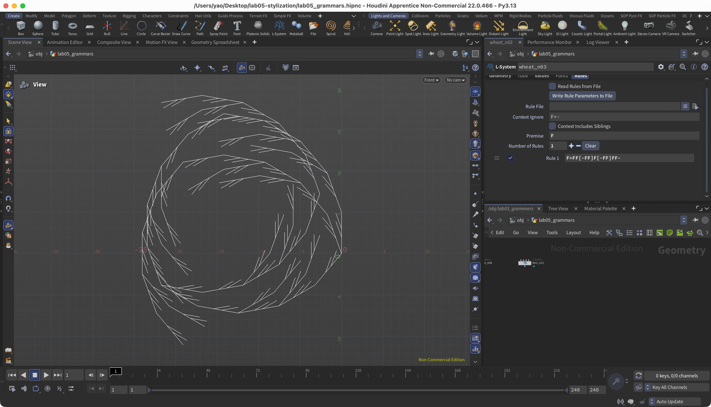

| n = 1 | n = 2 | n = 3 |
| --- | --- | --- |
| 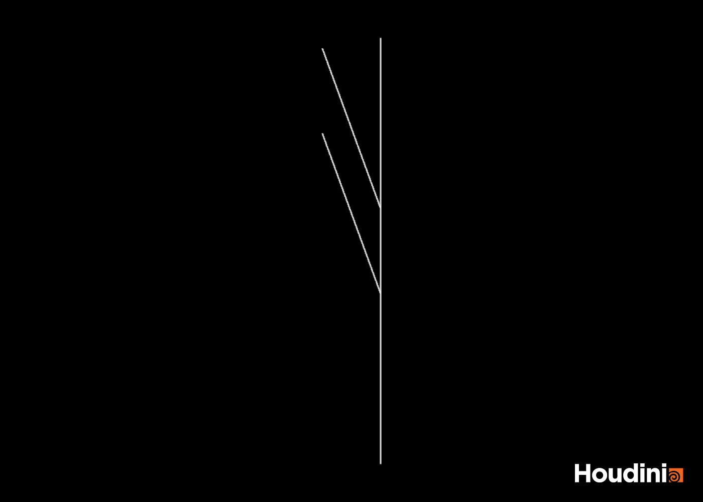 | 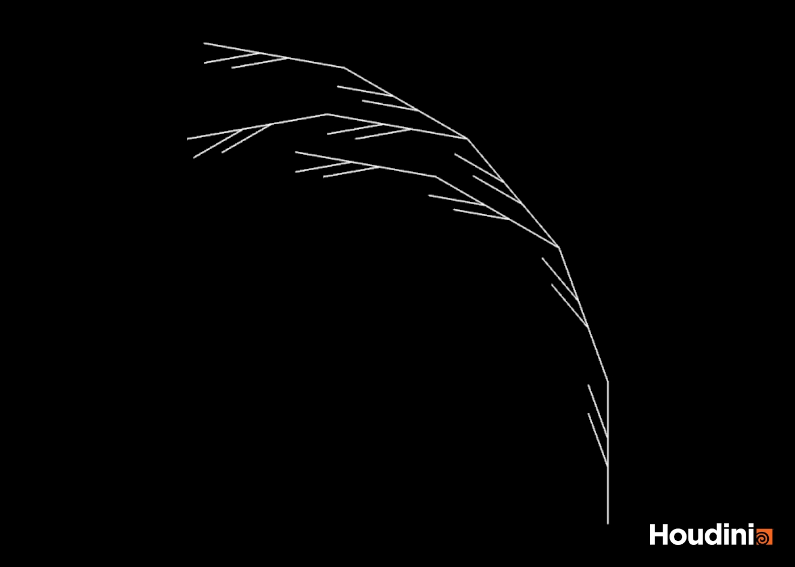 | 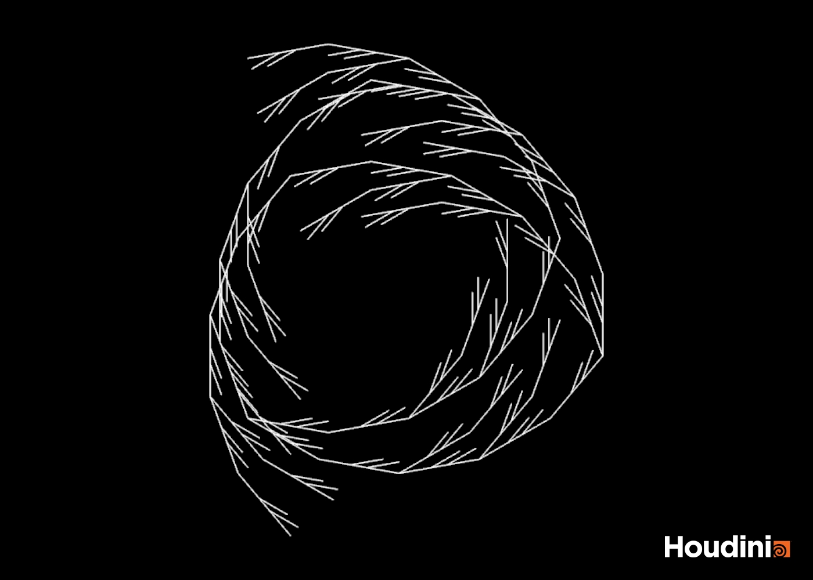 |

The rule replaces each `F` with a stem and two side branches. The stem has five steps, and each branch has two steps. The branches start after the second and third steps of the stem. The brackets save and restore the turtle state, so drawing a branch does not change the rest of the stem.

The important part is the final `-` outside the brackets. It turns the turtle left by 20 degrees after drawing the stem. This turn is not visible at `n = 1`, but it changes the direction of later segments when the rule is applied again. The pattern bends at `n = 2` and forms a spiral at `n = 3`.

The three results contain 9, 81, and 729 segments. Each image is fitted separately to show the whole pattern.

Rule file: [wheat.txt](grammars/wheat.txt).

## 2. Square grammar puzzle

| Setting | Value |
| --- | --- |
| Premise | `+F` |
| Rule 1 | `F=F+F-F-F+F` |
| Angle | `90` degrees |
| Step Size | `1` |
| Generations | `1`, `2`, `3` |
| Geometry Type | Skeleton |
| Random Scale | `0` |

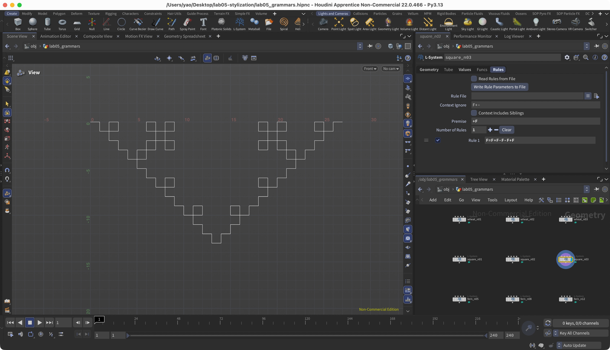

| n = 1 | n = 2 | n = 3 |
| --- | --- | --- |
| 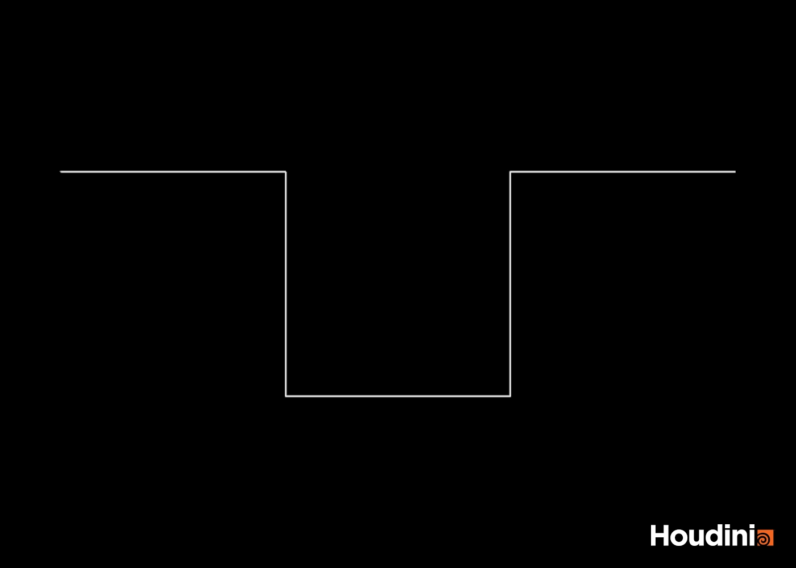 | 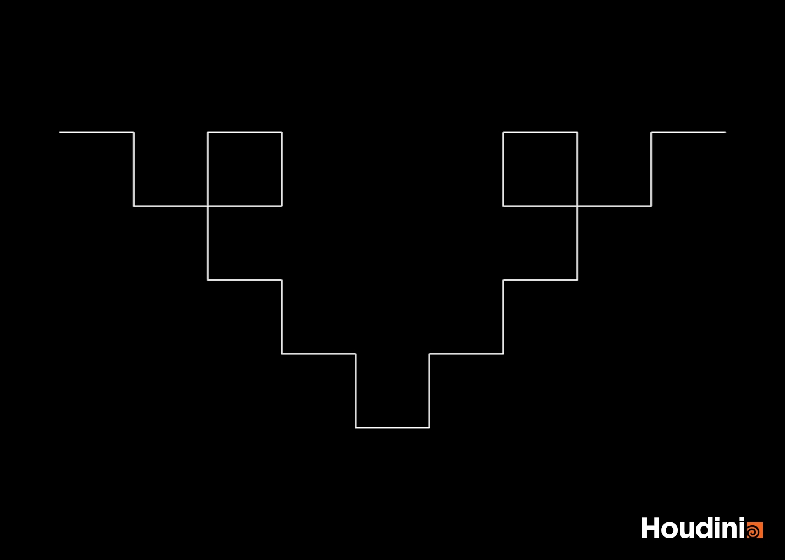 | 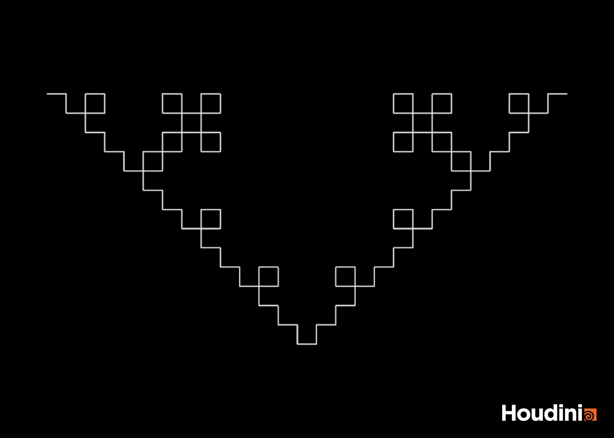 |

I used `+F` as the premise so the line starts toward the right. The rule replaces each line with five segments. With a 90-degree angle, the first result goes right, down, right, up, and right. The turtle finishes facing the same direction as it started.

Applying the same rule to every segment produces the smaller square loops in the next two iterations. The segment count grows from 5 to 25 to 125. The overlapping lines are part of the pattern.

Rule file: [square.txt](grammars/square.txt).

## 3. Custom plant: Southern lady fern

### Reference

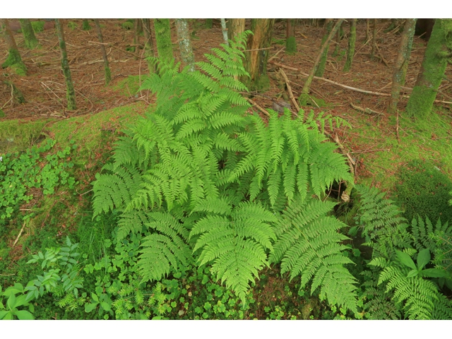

Reference: [NC State Extension, Southern Lady Fern](https://plants.ces.ncsu.edu/plants/athyrium-asplenioides/). Photograph by Alan Cressler, listed as [Public Domain Mark 1.0](https://creativecommons.org/publicdomain/mark/1.0/) on that page.

I chose the Southern lady fern because its fronds have a repeated branching structure. A central stem supports side branches called pinnae, and each pinna has smaller leaf divisions called pinnules. I modeled one frond with three rules for these three parts. The model is flat and uses simple leaf shapes; it does not include the detailed leaf edges or spores.

### Rules

Premise: `F(0.8,0.035)A(1)`

```text
A(s)=F(0.45*s,0.035*s)[+(68)B(0.9*s)]F(0.45*s,0.035*s)[-(68)B(0.9*s)]-(1.5)A(0.90*s)

B(s)=F(0.32*s,0.018*s)[+(55)C(0.90*s)][-(55)C(0.90*s)]F(0.28*s,0.018*s)B(0.82*s)

C(s)=[{.+(18)f(0.5*s).-(36)f(0.5*s).-(144)f(0.5*s).}][F(0.9510565*s,0.008*s)]
```

| Component | Role |
| --- | --- |
| Premise | Draws a short stalk and starts the main growing tip, `A(1)`. |
| `A(s)` | Grows the main stem and adds side branches at different heights on the two sides. Multiplying the size by 0.90 makes the upper parts smaller. The 1.5-degree turn gives the stem a small bend. |
| `B(s)` | Grows each side branch and adds two small leaves. The next section uses 82% of the size, so the branch becomes smaller toward its tip. |
| `C(s)` | Draws a leaf with four vertices and a line for its central vein. This rule does not produce another growing symbol, so a finished leaf stays the same in later iterations. |
| `s` | Controls the length and width of a component. `F(length,width)` sets these values explicitly. |
| `{`, `.`, `}` | Start a polygon, record its vertices, and close it. Lowercase `f` moves between vertices without drawing extra line segments. |

I set the lengths and angles directly in the fern rules. The node uses Skeleton geometry, Step Size `1`, and Random Scale `0`. The default Angle is `25`, but the angles written in the rules override it.

### Iterations

| n = 5 | n = 8 | n = 12 |
| --- | --- | --- |
| 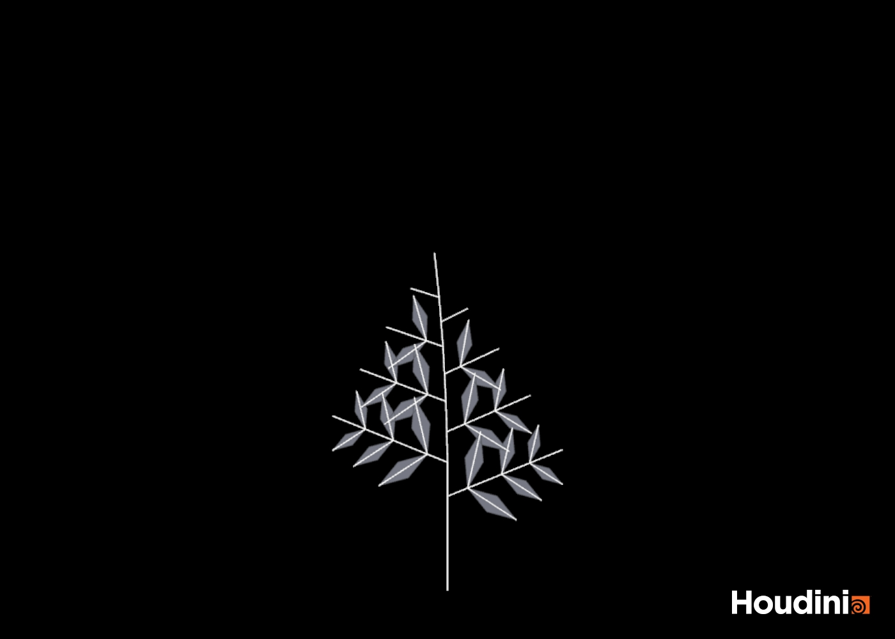 | 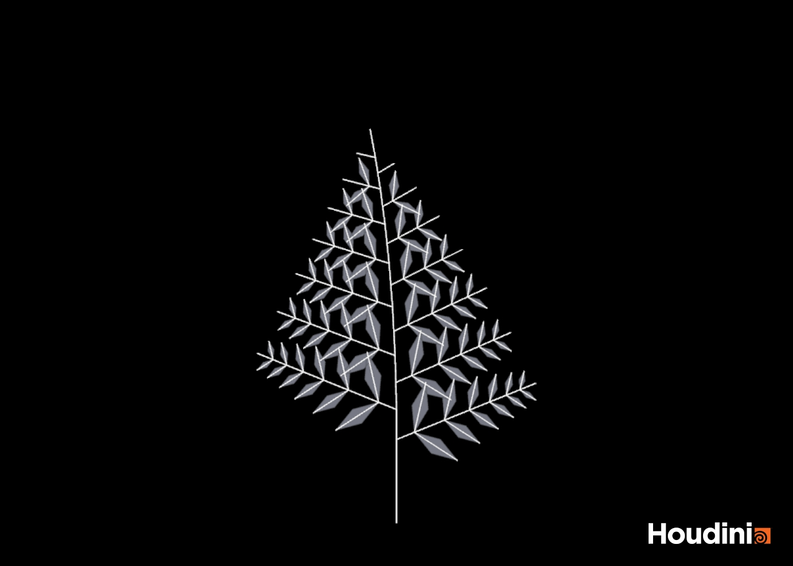 | 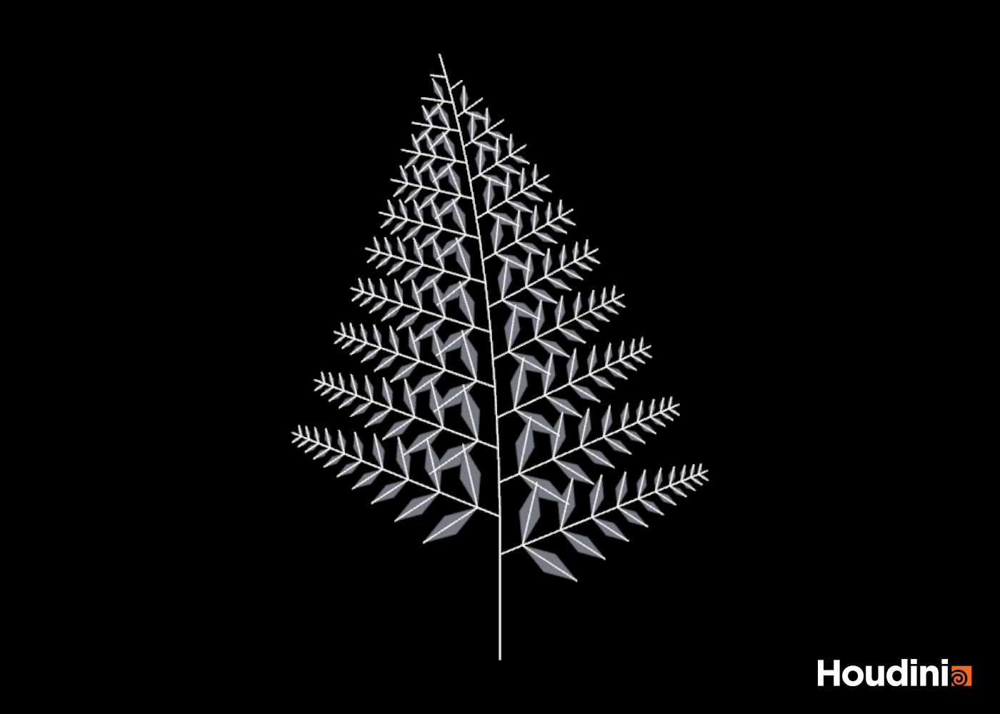 |

| Generation | Line segments | Leaf blades |
| --- | ---: | ---: |
| 5 | 75 | 24 |
| 8 | 213 | 84 |
| 12 | 509 | 220 |

These images use the same scale. More iterations make the main stem longer and add leaves to the older branches. A new `B` from rule `A` expands in the next iteration, and its new `C` symbols become leaves one iteration after that. This is why the newest tips have fewer leaves.

Rule file: [fern.txt](grammars/fern.txt).

## Project file

The scene is saved in [lab05_grammars.hipnc](lab05_grammars.hipnc). It contains nine L-System nodes under `/obj/lab05_grammars`, one for each iteration shown above. Select a node and turn on its blue display flag to view that result. The rules are saved inside the scene.

I checked all nine nodes in Houdini without errors or warnings. The segment counts and leaf counts are recorded in [validation.json](houdini/validation.json).

## References

- [SideFX L-System SOP documentation](https://www.sidefx.com/docs/houdini/nodes/sop/lsystem.html): turtle commands, parametric rules, and polygon syntax.
- [NC State Extension: Southern Lady Fern](https://plants.ces.ncsu.edu/plants/athyrium-asplenioides/): plant structure and reference photograph by Alan Cressler, Public Domain Mark 1.0.
