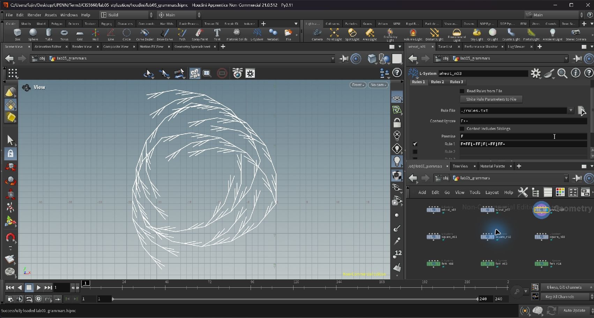
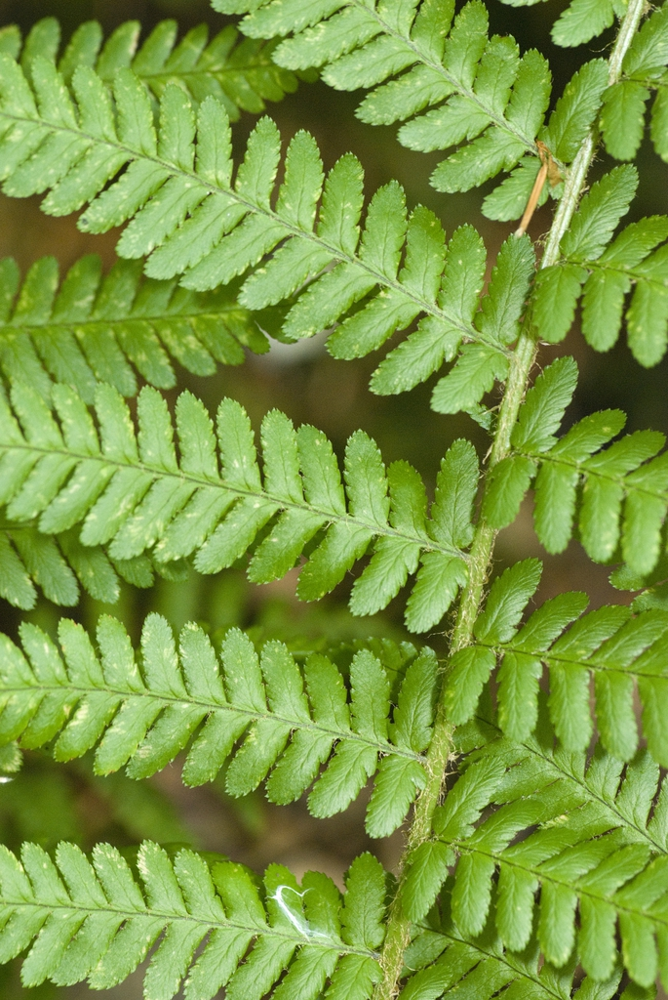
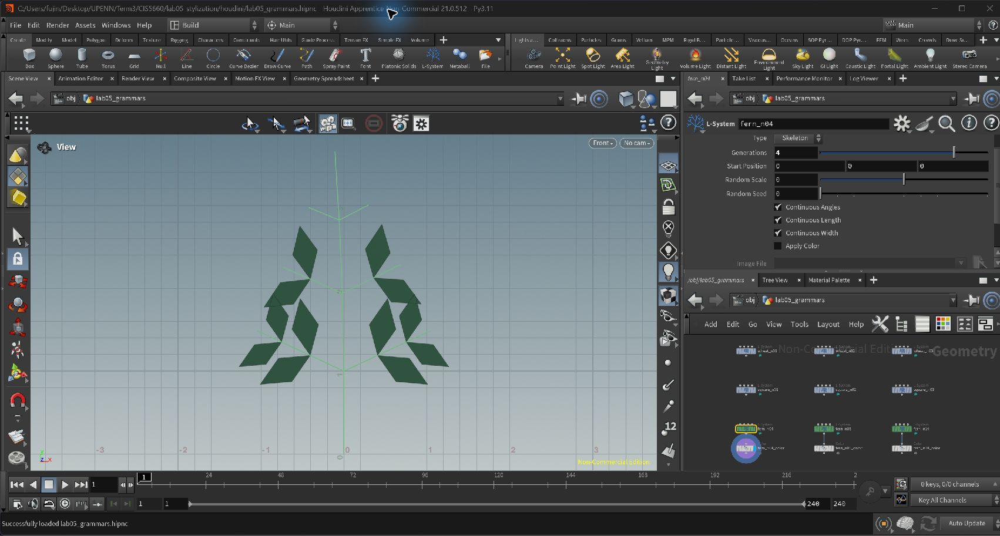
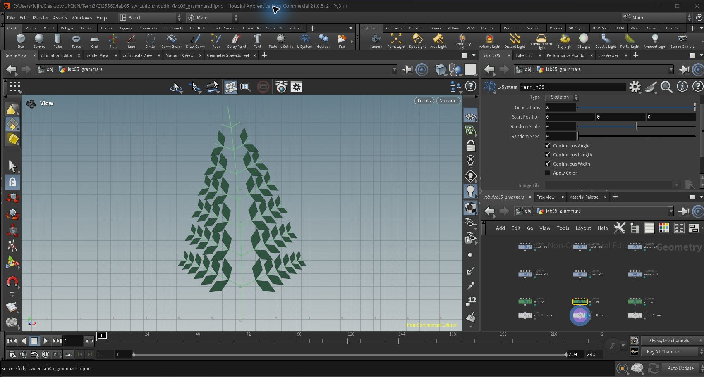
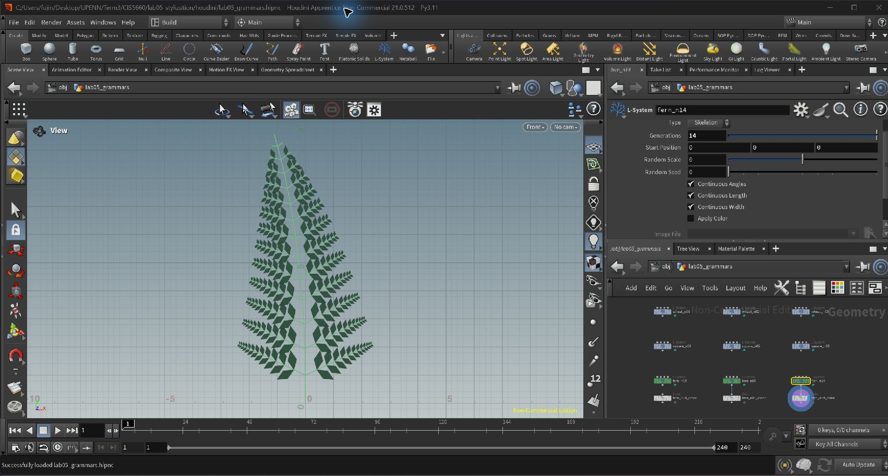
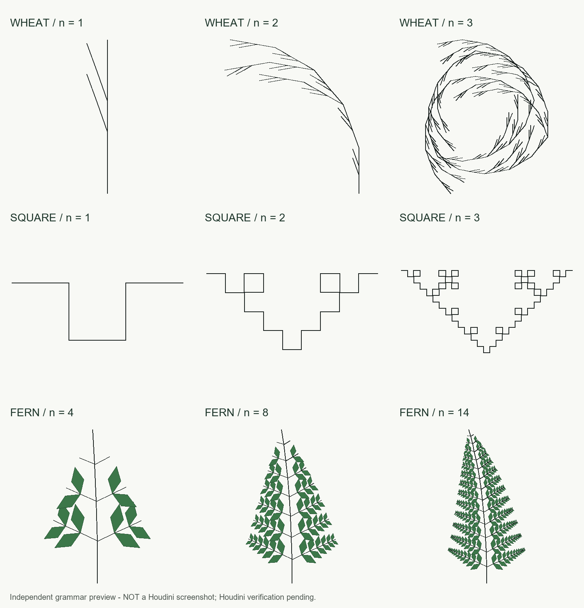

# Lab 05 — L-system Grammars

Created and verified in **Houdini Apprentice 21.0.512**. Open [`houdini/lab05_grammars.hipnc`](houdini/lab05_grammars.hipnc) to inspect all three exercises. The scene contains nine L-system nodes and three Color nodes for the fern. Actual Houdini screenshots are included below. The pull request has not yet been created.

## 1. Wheat grammar puzzle

| Parameter | Value |
| --- | --- |
| Premise | `F` |
| Rule 1 | `F=FF[-FF]F[-FF]FF-` |
| Angle | `20` degrees |
| Step Size | `1` |
| Type | Skeleton |
| Included generations | `1`, `2`, `3` |

The first `FF` draws two steps of the main stem. `[-FF]` saves the current turtle state, turns left, draws a two-step side branch, and restores the original state. A single `F` separates the two side branches; the last `FF` completes the main stem.

The final `-` is **outside** the brackets. It leaves the turtle rotated after each replacement. This has no visible effect on the end of the first generation, but changes the direction of subsequent replacements in later generations, creating the curling structure in the reference. Removing this turn produces a different result.

There are nine `F` symbols in the replacement: generations 1, 2, and 3 contain 9, 81, and 729 drawn segments.



## 2. Square grammar puzzle

| Parameter | Value |
| --- | --- |
| Premise | `+(90)F` |
| Rule 1 | `F=F+F-F-F+F` |
| Angle | `90` degrees |
| Step Size | `1` |
| Type | Skeleton |
| Included generations | `1`, `2`, `3` |

The initial `+(90)` points the turtle horizontally. Each `F` is replaced by five segments: forward, down, forward, up, forward, relative to that segment's starting orientation. The four turns cancel, so the replacement finishes with its original heading. Applying the same substitution to every segment creates the nested square pattern. The images are framed independently; no extra length-scaling rule is needed.

Generations 1, 2, and 3 contain 5, 25, and 125 drawn segments.


## 3. Custom plant — stylized male fern

### Reference and components

The reference is *Dryopteris filix-mas* (male fern), using the photograph and description in the [NC State Extension Plant Toolbox](https://plants.ces.ncsu.edu/plants/dryopteris-filix-mas/). The photograph shows a central leaf axis, lateral pinnae, and smaller lobed divisions along each pinna. These three levels motivate three distinct grammar symbols.



Reference photograph: **Olivier Pichard**, *Dryopteris filix-mas*, via NC State Extension; [CC BY-SA 3.0](https://creativecommons.org/licenses/by-sa/3.0/). [Original image](https://eit-planttoolbox-prod.s3.amazonaws.com/media/images/Dryopteris_filix-mas_zVeBgBS6i9ZW.jpeg). The local image is unmodified and retains its original license.

This model represents one stylized frond. It simplifies the small divisions to pointed diamond-shaped polygons and approximates their attachment as opposite pairs; it does not model serrations, spores, roots, or a full clump.

### Grammar

Premise: `A(1)`

```text
A(l)=F(l)[+(65)B(l*1.4)][-(65)B(l*1.4)]-(1.2)A(l*0.94)
B(l)=F(l*0.32)[+(55)C(l*0.5)][-(55)C(l*0.5)]B(l*0.85)
C(l)={. +(25)f(l*0.55). -(50)f(l*0.55). -(130)f(l*0.55). -(50)f(l*0.55).}
```

Use Type **Skeleton**, Step Size **1**, Random Scale **0**, and generations **4, 8, 14**. The listed rules provide explicit lengths and turning angles; the default Angle parameter can be left at **25**.

| Symbol / rule | Structural role |
| --- | --- |
| `A(l)` | Extends the main leaf axis by `l`, starts a pinna on each side at 65 degrees, and continues the axis at 94% of the previous step length. A 1.2-degree turn produces gentle curvature. |
| `B(l)` | Extends a pinna by `0.32*l`, starts two small leaf divisions at 55 degrees, and continues the pinna at 85% of its previous scale. |
| `C(l)` | Creates a filled polygon for a small leaf division. Four equal edges and alternating turns close a pointed diamond. It has no recursive symbol, so an existing leaf polygon is not subdivided again. |
| `l` | The local length parameter. Different scales along the main axis and pinnae create tapering. |

Square brackets restore the attachment position and direction after drawing each side branch. `F` draws a line; lowercase `f` moves without drawing a stem. `{`, `.`, and `}` begin a polygon, record its vertices, and close it.

Rules are rewritten simultaneously: a new `B` expands on the following iteration, and a new `C` becomes a polygon one iteration after that. Older lower pinnae consequently have more detail than newer upper ones. This is a discrete grammar-growth model, not a biological timing simulation.

### Houdini iterations

Each image is an unedited screenshot of Houdini in Front view. The parameter panel records the generation number. A downstream **Color SOP** supplies green `Cd = (0.18, 0.48, 0.24)` to the stems and leaf polygons; it does not change their positions or topology.

| Iteration | Stem segments | Small leaf polygons |
| --- | ---: | ---: |
| 4 | 16 | 12 |
| 8 | 64 | 84 |
| 14 | 196 | 312 |

**Generation 4** — a young axis and the first small leaf divisions:



**Generation 8** — the older pinnae have developed additional divisions:



**Generation 14** — a denser, tapering frond with a gently curved main axis:



### Independent comparison preview



**Image provenance:** this comparison grid is an independent Python turtle drawing. The screenshots above are from the actual Houdini scene. Native Houdini line segments and polygon vertices were compared with the independent interpreter for all nine iterations; the maximum coordinate comparison error was below `0.000018` scene units for a unit starting step. See [`houdini/geometry_comparison.json`](houdini/geometry_comparison.json).

## Reproduce in Houdini

1. Open [`houdini/lab05_grammars.hipnc`](houdini/lab05_grammars.hipnc) and enter `/obj/lab05_grammars`.
2. The top row contains `wheat_n01` through `wheat_n03`; the second row contains `square_n01` through `square_n03`. Enable a node's blue display flag to view it, and select **Rules** to inspect its premise and production rule. The default turning angle is on the **Values** tab.
3. The bottom row contains `fern_n04`, `fern_n08`, and `fern_n14`. Enable the blue flag on the corresponding downstream `_color` node for the green result, then select the L-system node to read or edit its rules.
4. Use **Front** view and frame the geometry after switching between nodes. Changing **Generations** on a selected L-system allows further exploration.

To rebuild from code, open a **new empty scene**, open **Windows > Python Source Editor**, load or paste [`scripts/build_lab05.py`](scripts/build_lab05.py), and run it with **Apply**. The script rejects scenes containing existing objects, checks for cooking errors and nonempty geometry, and saves a new file under `houdini/` without overwriting previous scene files.

The scene was built and reopened successfully in Houdini 21.0.512. All L-system nodes cooked without errors or warnings. [`houdini/lab05_grammars.validation.json`](houdini/lab05_grammars.validation.json) records their point and primitive counts.

The independent preview can be regenerated with Python and Pillow by running `scripts/preview_grammars.py`. It implements the 2D commands used here; it is not a replacement for Houdini validation.

## Submission checklist

- [x] Derive the two single-rule solutions and compare all three iterations with the assignment images.
- [x] Choose a real fern reference and explain a multi-rule structure.
- [x] Prepare the Houdini builder and independent iteration preview.
- [x] Verify all nine nodes in Houdini; save the native scene.
- [x] Add the wheat and square **Houdini rules screenshots**.
- [x] Add several **Houdini plant iteration images**.
- [ ] Review the final README and create the required pull request.

Syntax reference: [SideFX — L-System SOP](https://www.sidefx.com/docs/houdini/nodes/sop/lsystem.html).

---

<details>
<summary>Original assignment</summary>

# lab05-grammars
Let's practice using grammars! For this lab, please pull up the L-system node in Houdini.

## 1. Wheat grammar puzzle
Look at these iterations (n = 1, 2, 3) of a one-rule grammar. Using the built in symbols in Houdini, design a grammar that produces this output. Take a screenshot of your rules.\


## 2. Square grammar puzzle
How about this one? Take a screenshot of your rules.\


## 3. Custom plant
Choose a plant in the world. Working off a reference, design a grammar that mimics the structure of that plant. Unlike our simple puzzles, please use multiple rules for greater complexity. Think carefully about the structure of your grammar! EXPLAIN the structure of your plant in the README. What are the components? What do each of the rules do? Be sure to also include images of a few iterations of your output plant. 

## Submission
- Create a pull request against this repository
- In your readme, list your solutions and format your README nicely
- Profit

</details>
