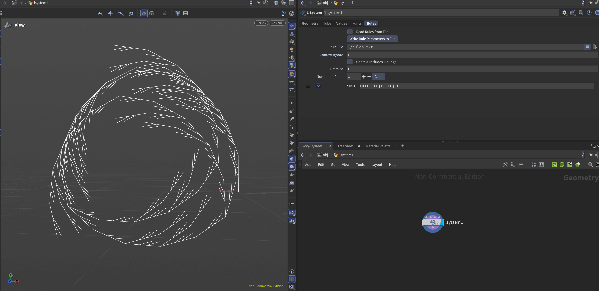
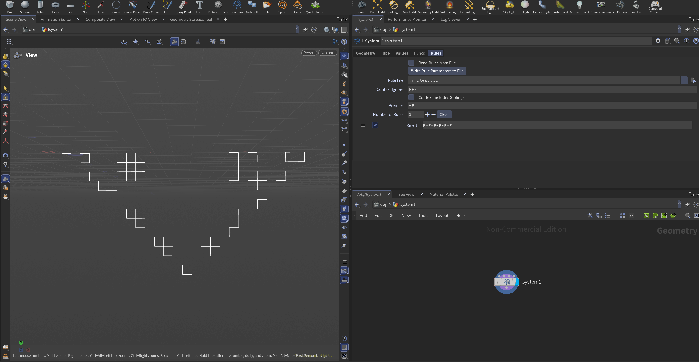
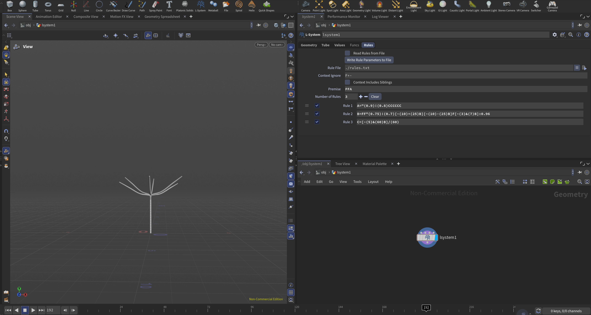
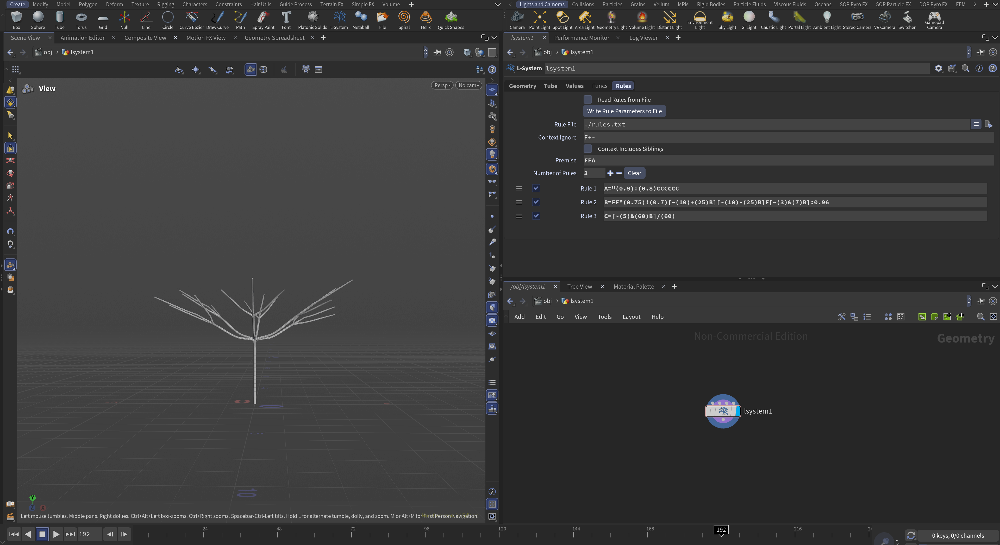
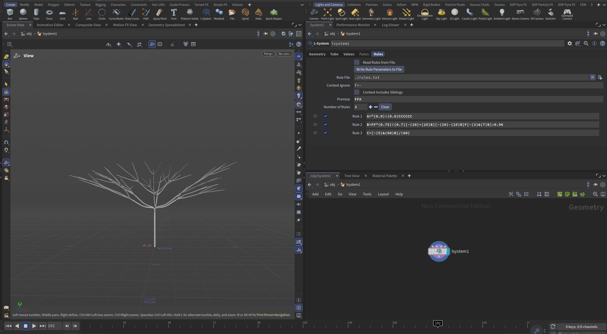
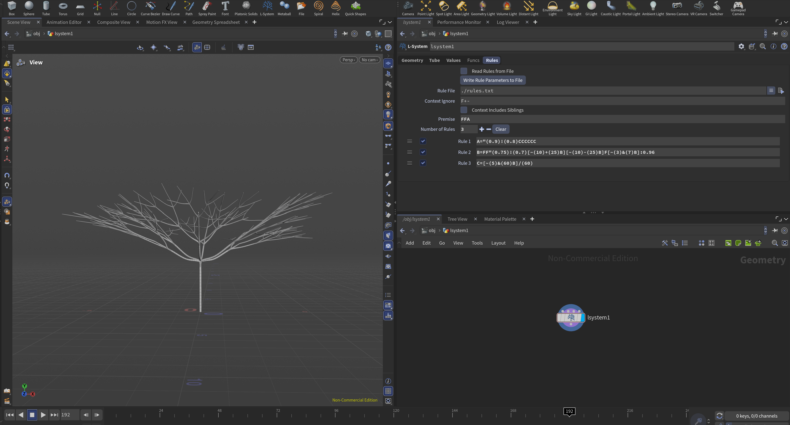
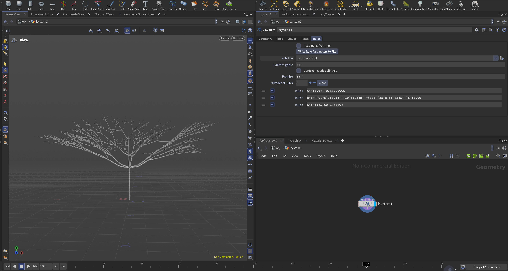

# lab05-grammars
Let's practice using grammars! For this lab, please pull up the L-system node in Houdini.

## Results
### Wheat

### Square

### Custom Plant - Umbrella Thorn Acacia

https://commons.wikimedia.org/wiki/File:Umbrella_thorn_acacia_or_israeli_babool_tree_plant_acacia_tortillis.jpg

I notice that the tree has a thick trunk and splits into multiple branches at each branching node. Also, the tree gets more and more horizontal as it gets taller, with thinner and shorter twigs. Therefore, my rules are structured as follows:
- Premise: `FFA`. This creates a relatively tall trunk.
- `A="(0.9)!(0.8)CCCCCC`. `A` generates at most six branches from the trunk that are a bit thinner and shorter.
- `C=[~(5)&(60)B]/(60)`. `C` is a helper for `A` that represents each of the dominant branch from the trunk. Each branch is separated from its neighbor by 60 degrees and angled away from vertical by 60 degrees, with a 5-degree perturbation.
- `B=FF"(0.75)!(0.7)[~(10)+(25)B][~(10)-(25)B]F[~(3)&(7)B]:0.96`. `B` recursively generates smaller and thinner branches. Each branch is extended by `FF` and generates at most three new branches: the middle branch is further extended by a shortened `F` and pushed downward by 7 degrees with a 3-degree perturbation, and the leftmost and rightmost branches are 25 degrees away from this middle branch with a 10-degree perturbation.

To make the tree look nicer and smoother, I added a branch blend of 0.3.

Here are screenshots with a few iterations (3, 4, 5, 6, 6.5):

## 1. Wheat grammar puzzle
Look at these iterations (n = 1, 2, 3) of a one-rule grammar. Using the built in symbols in Houdini, design a grammar that produces this output. Take a screenshot of your rules.\

## 2. Square grammar puzzle
How about this one? Take a screenshot of your rules.\

## 3. Custom plant
Choose a plant in the world. Working off a reference, design a grammar that mimics the structure of that plant. Unlike our simple puzzles, please use multiple rules for greater complexity. Think carefully about the structure of your grammar! EXPLAIN the structure of your plant in the README. What are the components? What do each of the rules do? Be sure to also include images of a few iterations of your output plant. 

## Submission
- Create a pull request against this repository
- In your readme, list your solutions and format your README nicely
- Profit
