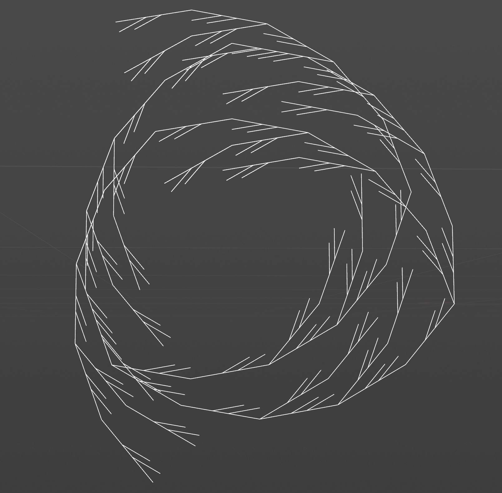
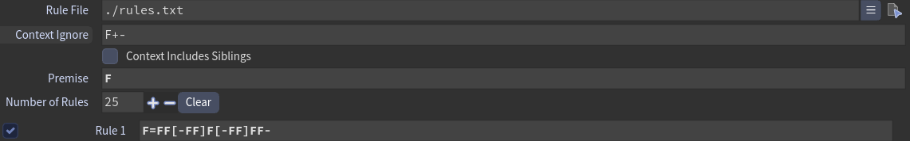
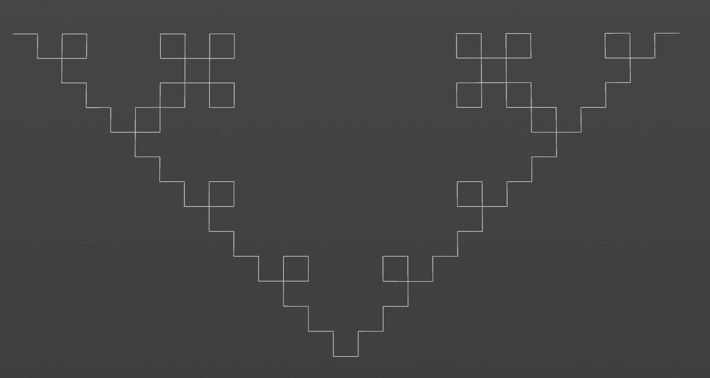
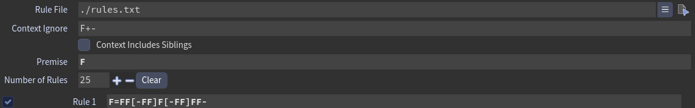
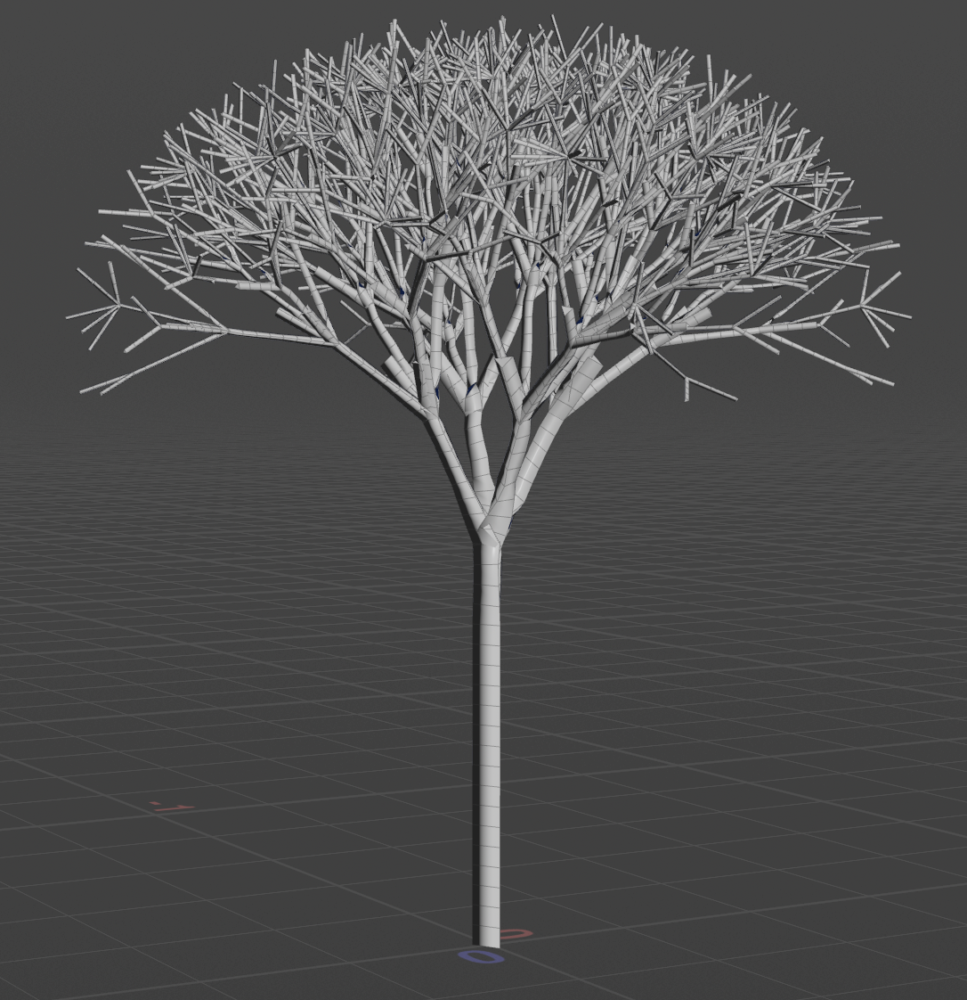
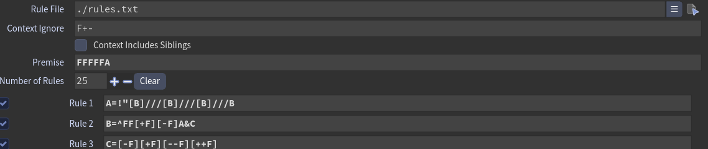
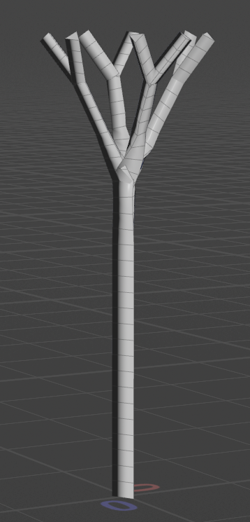
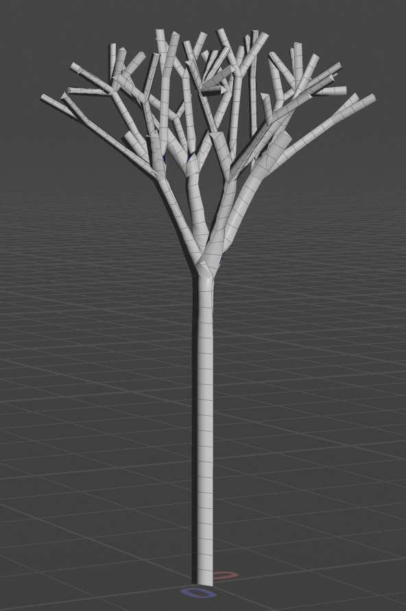
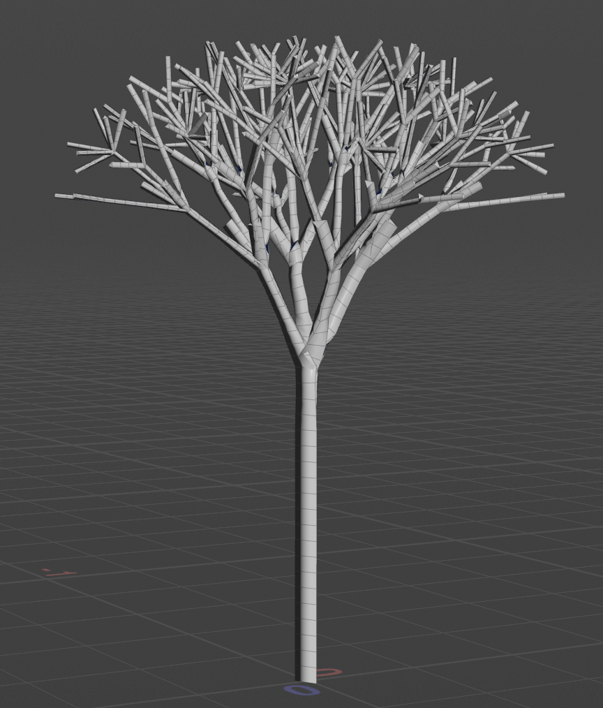

# lab05-grammars
Let's practice using grammars! For this lab, please pull up the L-system node in Houdini.

## 1. Wheat grammar puzzle

## 2. Square grammar puzzle

## 3. Custom plant

This is a Japanese elm.

| Iterations | Output |
|------------|--------|
| 2 |  |
| 4 |  |
| 6 |  |

Starting from Houdini L-System’s default rules, I adjusted the orientation of the branches and added more smaller branches and twigs.

**A** creates several main branches using **B** spreading in different directions.

**B** extends each main branch with FF, creates two side branches using [+F] and [-F], and then continues the recursive structure through **A**.

**C** creates four short terminal branches pointing at different angles.

## Submission
- Create a pull request against this repository
- In your readme, list your solutions and format your README nicely
- Profit
