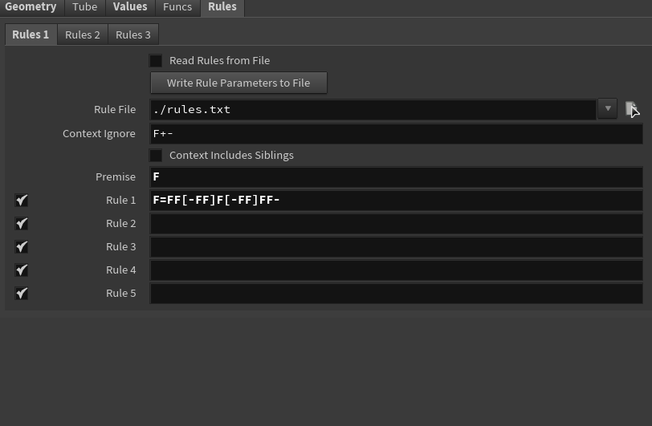
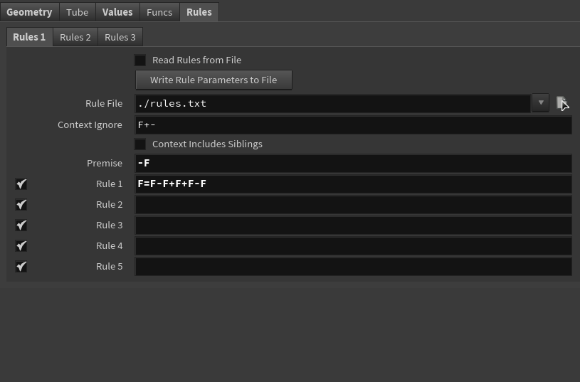
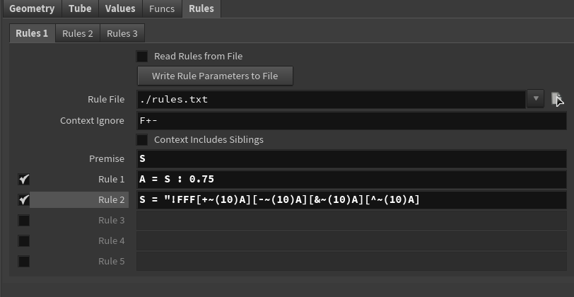
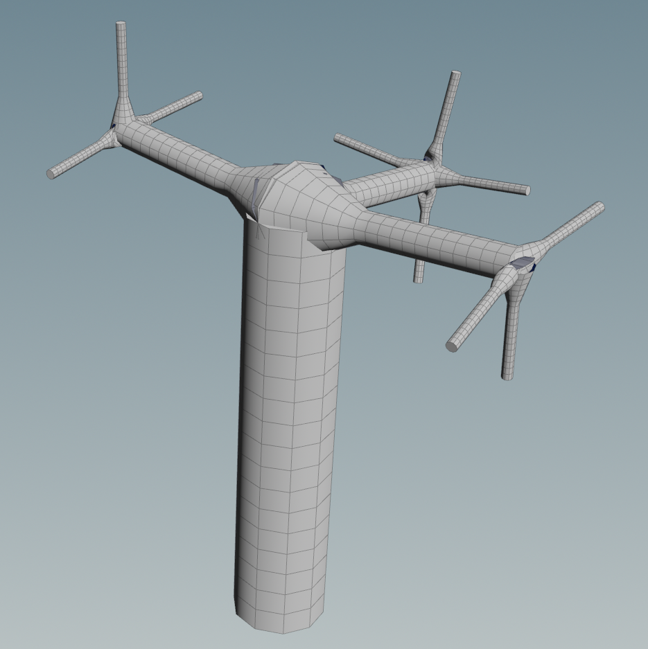
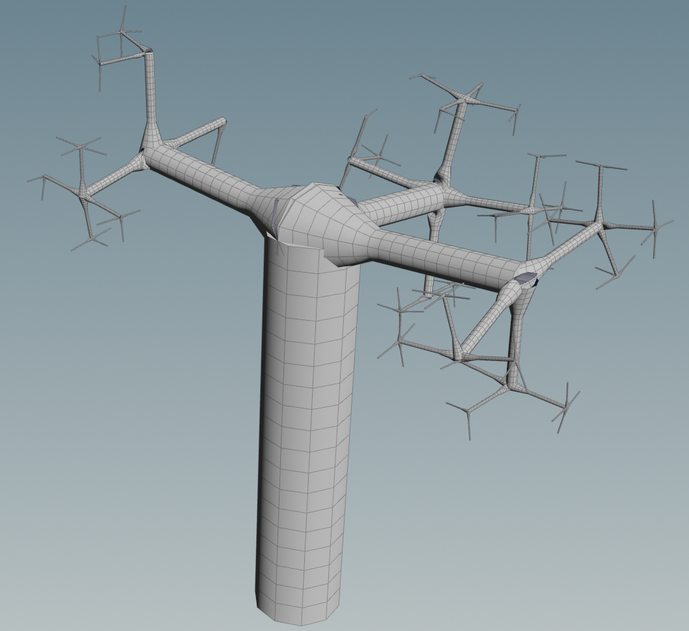
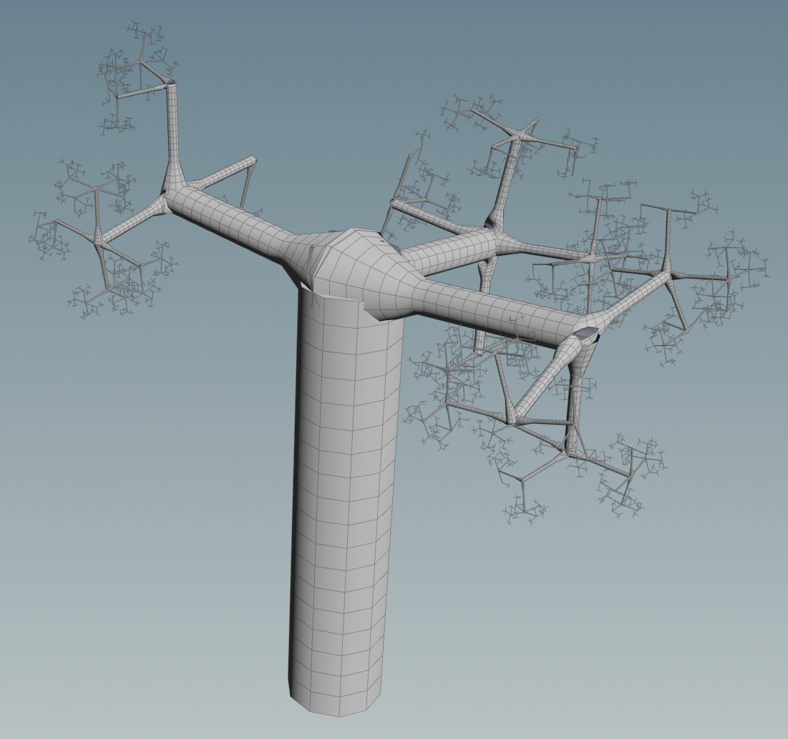

# Nathan Chortek Submission

## Wheat grammar puzzle

## Square grammar puzzle

## Custom plant

### Reference

The tree has a very thick trunk with a relatively flat top. Each branch then grows roughly perpendicularly to from the tip of its preceding limb, with decreasing in thickness.

### Rules

**Rule 1**
* This helps randomize the number of branches grown at each iteration. With `: 0.75`, each of the 4 possible branches in Rule 2 have a 75% chance of growing.

**Rule 2**
* `"`: Multiplies the current length by `Step Size Scale`. This causes each iteration to be shorter than the last when combined with `Step Size Scale < 1`.
* `!`: Multiplies the current thickness by `Thickness Scale`. This causes each iteration to be thinner than the last when combined with `Thickness Scale < 1`.
* `FFF`: Grows a branch forward 3 steps.
* `~(10)`: Applies a random rotational offset up to 10 degrees, adding non-uniformity to the branch directions while remaining close to a default of 90 degrees.
* `+`, `-`, `&`, `^`: Causes each of the 4 possible branches to grow perpendicularly from the tip of the preceding branch, forming a rough 4-lane "crossroads" pattern. When combined with Rule 1, each crossroad has a variable number of segments.

### Results

**5 Iterations**

**10 Iterations**

**15 Iterations**

# lab05-grammars
Let's practice using grammars! For this lab, please pull up the L-system node in Houdini.

## 1. Wheat grammar puzzle
Look at these iterations (n = 1, 2, 3) of a one-rule grammar. Using the built in symbols in Houdini, design a grammar that produces this output. Take a screenshot of your rules.\

## 2. Square grammar puzzle
How about this one? Take a screenshot of your rules.\

## 3. Custom plant
Choose a plant in the world. Working off a reference, design a grammar that mimics the structure of that plant. Unlike our simple puzzles, please use multiple rules for greater complexity. Think carefully about the structure of your grammar! EXPLAIN the structure of your plant in the README. What are the components? What do each of the rules do? Be sure to also include images of a few iterations of your output plant. 

## Submission
- Create a pull request against this repository
- In your readme, list your solutions and format your README nicely
- Profit
