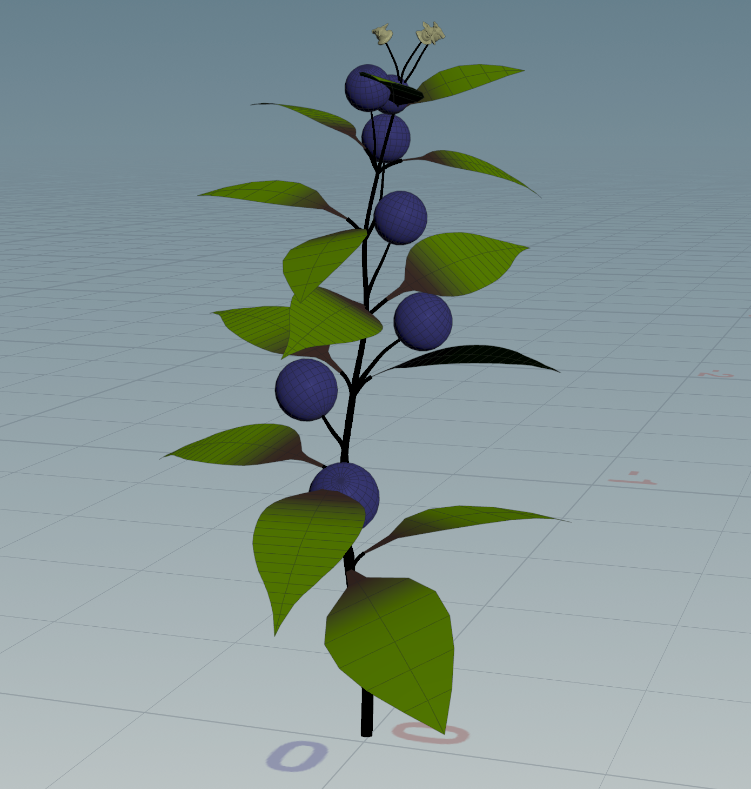
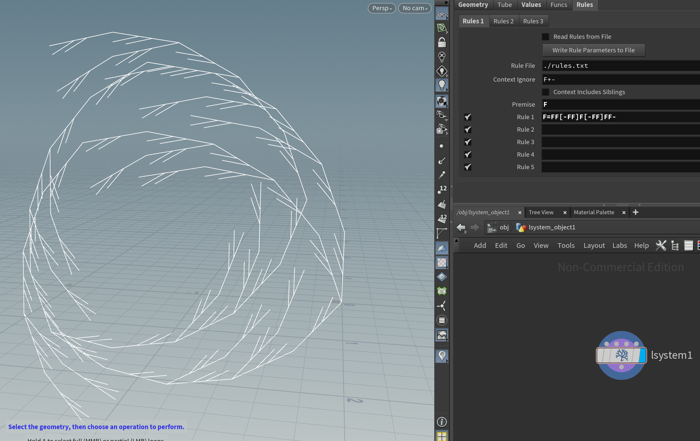
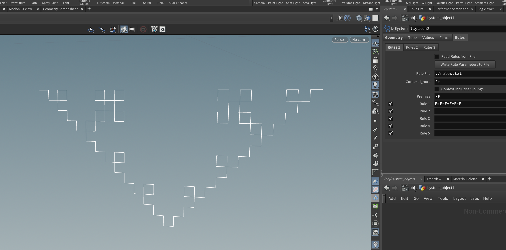
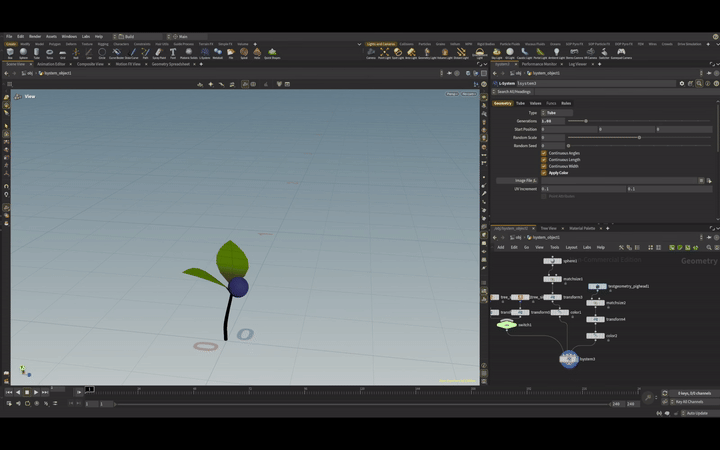
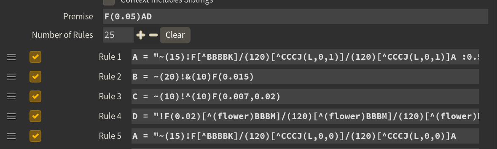

# lab05-grammars

Let's practice using grammars! For this lab, please pull up the L-system node in Houdini.

## 1. Wheat grammar puzzle
Look at these iterations (n = 1, 2, 3) of a one-rule grammar. Using the built in symbols in Houdini, design a grammar that produces this output. Take a screenshot of your rules.\

## 2. Square grammar puzzle
How about this one? Take a screenshot of your rules.\

## 3. Custom plant

These are the rules I used to create this flower. A is the main stem, and there are two variants for two different leaves, which are indepdently chosen with 50% probability. The (L,0,1) is a way to pass info upstream to the stamp expression in my switch statement between two leaves.

B is the formula for the flower.
C is the formula for the leaves.
D is the formula for the budding at the top (which only appears at the end since we include it after A in the Premise).

Followed this tutorial: https://www.youtube.com/watch?v=0vE8GiXhOWM

## Submission
- Create a pull request against this repository
- In your readme, list your solutions and format your README nicely
- Profit
