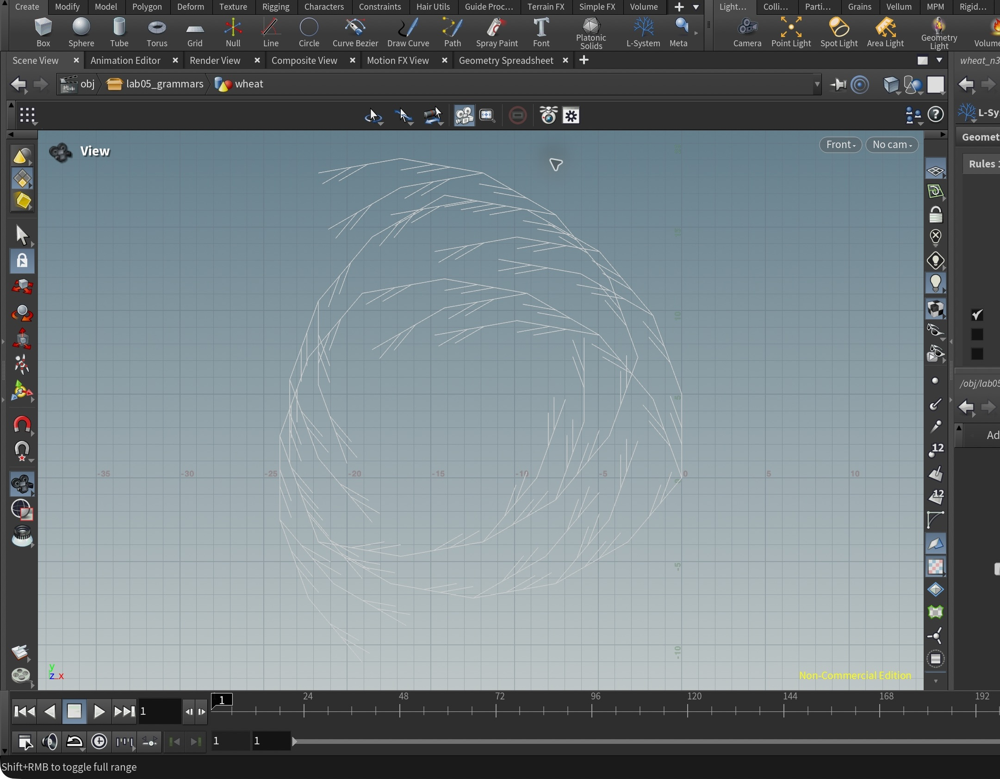
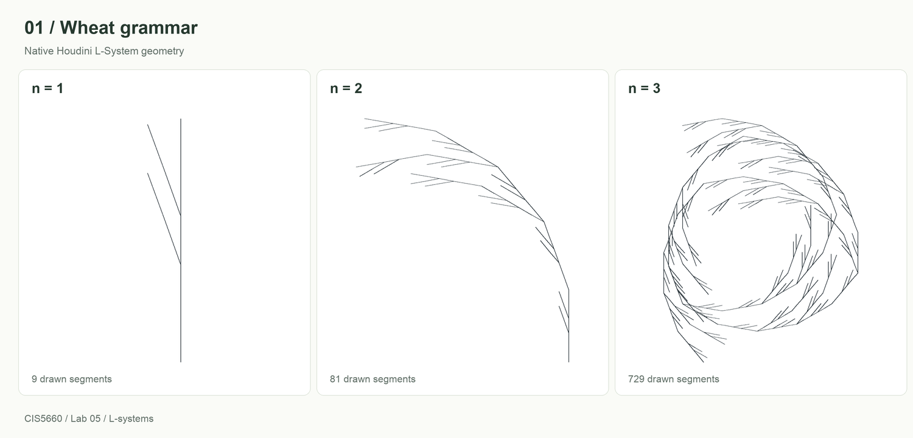
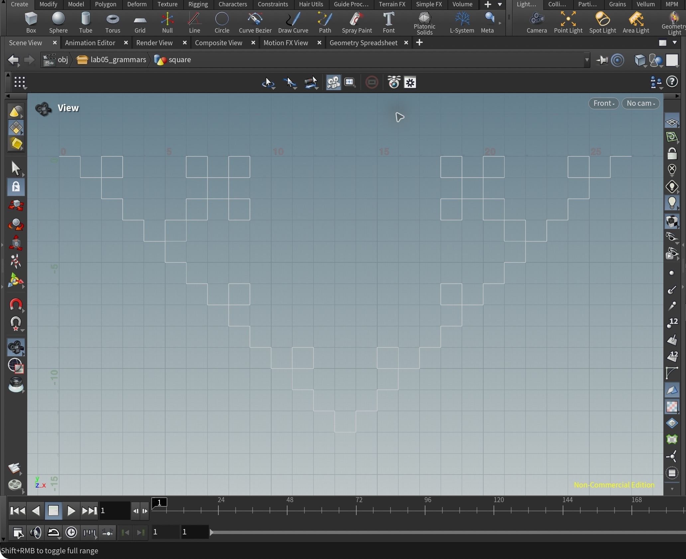
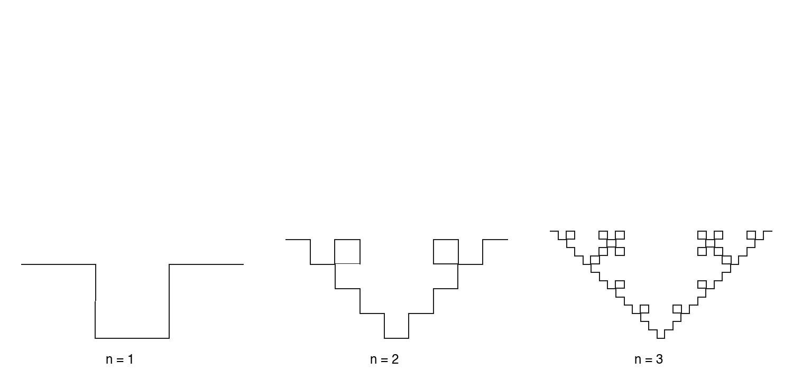
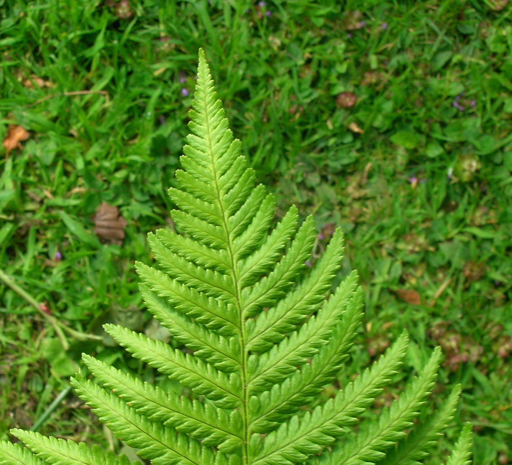
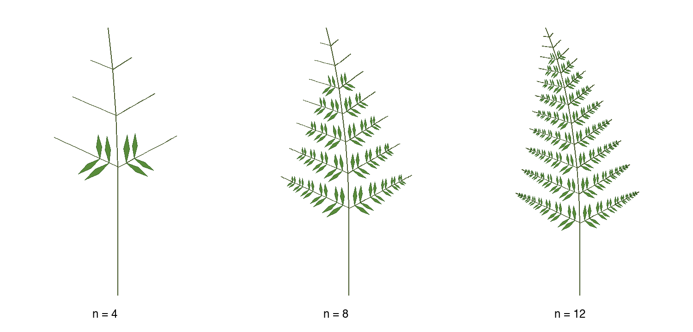
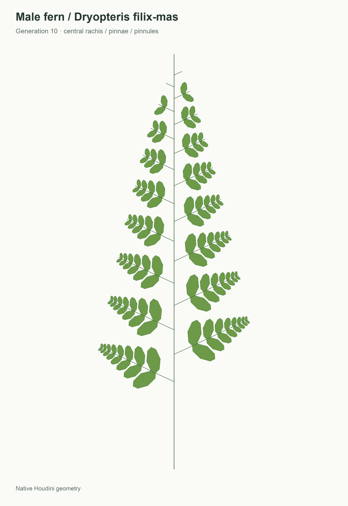
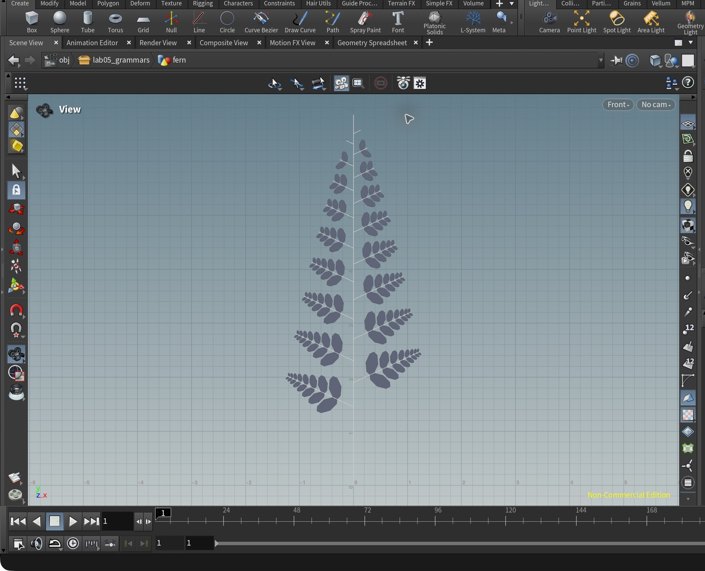

# Lab 05 Grammars

## 1. Wheat grammar puzzle

| Parameter         | Value                |
| ----------------- | -------------------- |
| Premise           | `F`                  |
| Rule 1            | `F=FF[-FF]F[-FF]FF-` |
| Angle             | `20` degrees         |
| Initial step size | `1`                  |
| Generations       | `1`, `2`, `3`        |
| Random scale      | `0`                  |

```text
F=FF[-FF]F[-FF]FF-
```

Each `F` is replaced by five forward steps along the main axis. Two bracketed branches, each two steps long, grow at the second and third main-axis steps. `[` saves the turtle state, and `]` restores it, so drawing a branch does not change the main axis. Each `-` turns left by 20 degrees.

The final `-` is essential. At generation 1 it changes only the heading after the visible geometry has been drawn. At later generations that rotation affects the next rewritten segment, producing the curved second iteration and the coiled third iteration. The same single rule is used for all three results.





## 2. Square grammar puzzle

| Parameter         | Value         |
| ----------------- | ------------- |
| Premise           | `+F`          |
| Rule 1            | `F=F+F-F-F+F` |
| Angle             | `90` degrees  |
| Initial step size | `1`           |
| Generations       | `1`, `2`, `3` |
| Random scale      | `0`           |

```text
F=F+F-F-F+F
```

Houdini starts the turtle pointing upward. The `+` in the premise turns it right by 90 degrees, so the curve starts horizontally. The rule replaces each forward segment with a five-segment path: forward, right turn, forward, left turn, forward, left turn, forward, right turn, forward. From a rightward heading, this draws right–down–right–up–right, giving the square dip in the first example.

The replacement preserves the incoming heading. Rewriting all five segments again produces the small square loops and stepped dip. A third rewrite adds smaller copies of the same pattern. The thin rectangular borders in the provided examples are not included in the grammar.

Each iteration triples the net span of the curve while multiplying the segment count by five. The figures are framed individually for comparison; the step size stays at 1 in every node.





## 3. Custom plant — Male fern

### Reference and structural goal

The reference is a male fern, *Dryopteris filix-mas*. The mature foliage in the lower part of the photograph shows the hierarchy used in this design: a central leaf axis (rachis), lateral divisions (pinnae), and smaller leaf divisions (pinnules). The model represents one stylized frond.



*Reference photograph: Leo Michels, April 2006, [Wikimedia Commons](https://commons.wikimedia.org/wiki/File:Dryopteris_filix-mas_IP0604053.jpg).* 

The grammar uses separate growth symbols for each structural level. Lateral pinnae alternate along the rachis. Older pinnae have more time to develop, while newer pinnae near the tip remain shorter. Shrinking length parameters produce a tapered outline and increasingly small pinnules toward each pinna tip.

| Parameter         | Value                                               |
| ----------------- | --------------------------------------------------- |
| Premise           | `F(1)A(0.45)`                                       |
| Default angle     | `25` degrees; explicit angles are used in the rules |
| Initial step size | `1`; lengths are specified in commands              |
| Generations shown | `4`, `7`, `10`                                      |
| Random scale      | `0`                                                 |
| Geometry          | Skeleton / explicit polygon leaves                  |

```text
Rule 1:
A(l)=F(l)[-(65)B(l*1.65)]F(l)[+(65)B(l*1.65)]A(l*0.90)

Rule 2:
B(l)=F(l*0.45)[-(55)C(l*0.65)][+(55)C(l*0.65)]B(l*0.78)

Rule 3:
C(l)=[{.+(55)f(l*0.18).-(40)f(l*0.36).-(30)f(l*0.36).-(40)f(l*0.18).-(70)f(l*0.18).-(40)f(l*0.36).-(30)f(l*0.36).-(40)f(l*0.18).}]
```

### What each rule does

**Premise — petiole and growing tip.** `F(1)` draws a bare petiole one unit long. `A(0.45)` starts the rachis with an initial internode length of 0.45.

**Rule 1 — rachis and alternating pinnae.** `A(l)` draws two rachis internodes. A left pinna starts after the first internode and a right pinna after the second, so they attach at different heights. Each pinna starts 65 degrees from the rachis. `A(l*0.90)` retains the growing apex and reduces the next internode length by 10%. Brackets restore the rachis position and heading after each side branch.

**Rule 2 — pinna axis and paired pinnules.** `B(l)` draws a short pinna-axis segment of length `0.45*l`, then places one `C` on each side at 55 degrees. Each pinnule receives length parameter `0.65*l`. `B(l*0.78)` continues the pinna with a 22% reduction in its length parameter. Earlier pinnae accumulate more segments and become longer than recently initiated ones.

**Rule 3 — pinnule surface.** `C(l)` draws an elongated, closed polygon. `{` and `}` delimit a polygon; `.` records a vertex; `f` moves without drawing a separate line. The eight moves form a symmetric outline with a pointed tip. The outer brackets restore the pinna's state after the polygon is made. `C` does not recur, so a completed pinnule keeps its size in later iterations.

Only `A`, `B`, and `C` are rewritten. Existing `F` segments and completed polygon commands remain unchanged, so increasing the generation count adds growth without regenerating older segments into a different structure.

### Iteration results

The three panels use the same framing and scale to show the growth process.



- **Generation 4:** The rachis is established, and the earliest pinnae have developed pinnules.
- **Generation 7:** More alternating pinnae appear, and older pinnae develop additional pairs of pinnules.
- **Generation 10:** The lower pinnae are fuller, while the newer pinnae near the apex remain shorter, producing a tapered frond.




