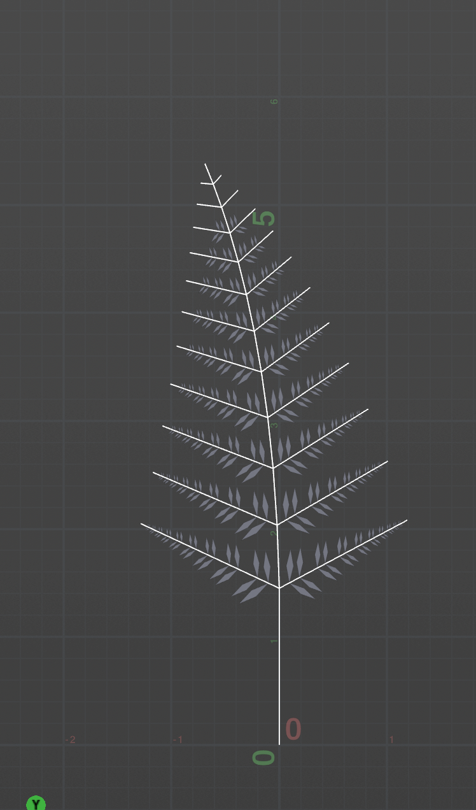

# Lab 05 — L-systems

Project file: [lab05.hipnc](lab05.hipnc). The three objects are `wheat`, `square`, and `fern`. Each has one L-system node for each iteration shown below.

## 1. Wheat grammar

```text
Premise: F
Angle: 20 degrees
Rule: F=FF[-FF]F[-FF]FF-
```

The five `F` symbols outside the brackets form the main stem. Each `[-FF]` adds a two-step branch, then returns to the stem. The final `-` is easy to miss: it leaves the first iteration's shape unchanged, but turns the next section in later iterations. That is what gives the larger shape its curl.

### Rules in Houdini


### Iterations 1, 2, and 3


## 2. Square grammar

```text
Premise: +(90)F
Angle: 90 degrees
Rule: F=F+F-F-F+F
```

The initial `+(90)` points the turtle to the right. The first replacement draws right, down, right, up, and right. Applying the same pattern to every segment gives 5, 25, and 125 segments in iterations 1, 2, and 3.

### Rules in Houdini


### Iterations 1, 2, and 3


## 3. Custom plant — fern

I chose a lady fern because its structure repeats at two levels: branches along the main stalk, then leaflets along each branch. The model keeps that arrangement and the taper toward the tip. It is a flat, simplified frond; the leaflets have straight edges rather than the small lobes in the photo.

| Reference photograph | My L-system, iteration 12 |
| --- | --- |
|  |  |

Reference photo: [Rosser1954, Lady Fern frond — normal appearance](https://commons.wikimedia.org/wiki/File:Lady_Fern_frond_-_normal_appearance.jpg), [CC BY-SA 3.0](https://creativecommons.org/licenses/by-sa/3.0/). The photo is included unchanged.

### Grammar

```text
Premise: F(0.8)A(0.65)
Angle: 20 degrees

A(l)=F(l)[-(65)B(l*.95)][+(62)B(l*.9)]-(2)A(l*.9)
B(l)=F(l*.18)D(l)F(l*.18)D(l*.9)F(l*.18)B(l*.78)
C(l)=[{.+(12)f(l/2).-(24)f(l/2).-(156)f(l/2).-(24)f(l/2).}]
D(l)=[-(60)C(l*.55)][+(60)C(l*.5)]
```

- **A — main stalk:** draws one section and starts a branch on each side. The next section is 90% as long, and a 2-degree turn curves the stalk. Slightly different angles and lengths keep the two sides from matching exactly.
- **B — side branch:** draws three short sections, places two pairs of leaflets, and continues with 78% of the previous length. This makes each branch taper too.
- **C — leaflet:** draws a narrow polygon. Braces define the polygon, dots mark its corners, and lowercase `f` moves without drawing stem lines. The brackets restore the branch's position and heading afterward.
- **D — leaflet pair:** places a leaflet on each side at 60 degrees. Keeping the pair in a separate rule lets **B** reuse it.

`l` is the length passed into each symbol. Rules are replaced in parallel: `B` produces `D`, then `D` produces `C`, and finally `C` draws the polygon. This delay leaves the youngest branches near the tip bare.

### Iterations 4, 8, and 12

Iteration 4 has the first leaflets. By iteration 8, the older branches have several pairs. Iteration 12 shows the fuller frond, with smaller branches toward the tip.


The comparison diagrams are drawn from the nodes' actual geometry. Each panel is fitted separately, so they compare structure rather than absolute size. Green makes the fern's leaf polygons easier to see.

Full Houdini screenshots: [iteration 4](images/fern_n4.png), [iteration 8](images/fern_n8.png), and [iteration 12 with the rule panel](images/fern_houdini.png).

## Opening the project

Open `lab05.hipnc` in Houdini. It opens on `fern_n12`. To view another result, enter its geometry object and turn on the desired node's blue display flag. The number in each node name is its generation count.

All nodes use **Skeleton** output and **Random Scale = 0**. The puzzle nodes use **Step Size = 1**. The fern uses explicit segment lengths in its rules. The results were checked in Houdini Apprentice 22.0.429; the project is saved as a non-commercial `.hipnc` file.
