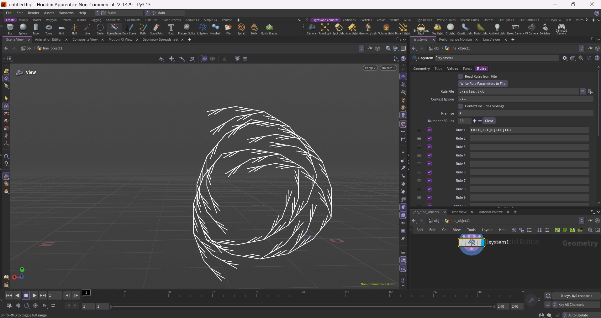
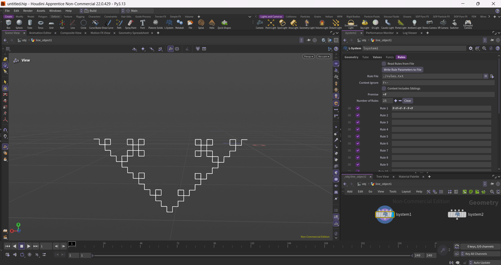
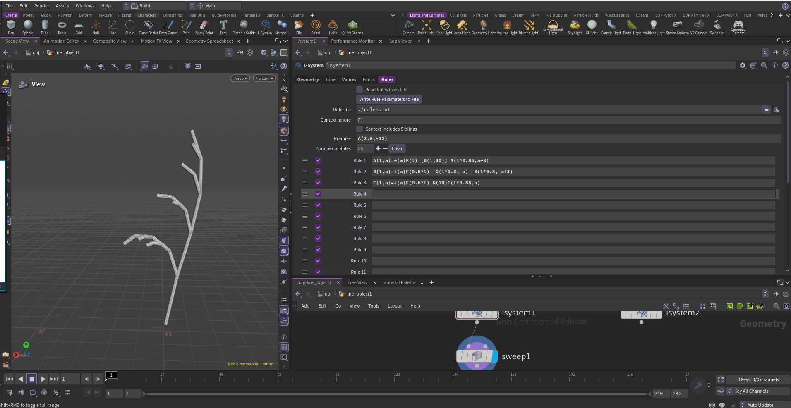
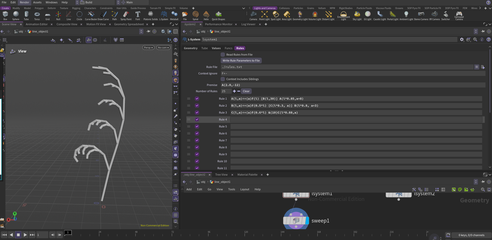
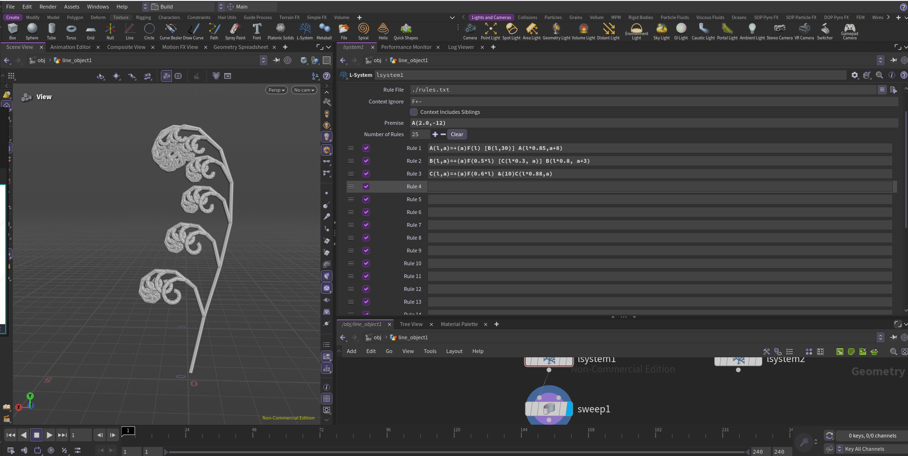
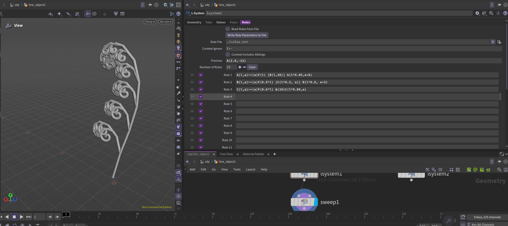

# lab05-grammars
Let's practice using grammars! For this lab, please pull up the L-system node in Houdini.

## 1. Wheat grammar puzzle
Look at these iterations (n = 1, 2, 3) of a one-rule grammar. Using the built in symbols in Houdini, design a grammar that produces this output. Take a screenshot of your rules.\

## 2. Square grammar puzzle
How about this one? Take a screenshot of your rules.\

## 3. Custom plant
Choose a plant in the world. Working off a reference, design a grammar that mimics the structure of that plant. Unlike our simple puzzles, please use multiple rules for greater complexity. Think carefully about the structure of your grammar! EXPLAIN the structure of your plant in the README. What are the components? What do each of the rules do? Be sure to also include images of a few iterations of your output plant. 

### Structure

For my custom plant, I chose a fiddlehead fern. I wanted to recreate its long curved main stem and the smaller curled segments that grow from it.

### Components

- **A - Main Stem:** Creates the main structure of the fern. It grows upward while changing its angle and segment length. As it grows, it creates B branches along the stem.
- **B - Secondary Curly Branch:** Creates the smaller curled branches coming from the main stem. These are scaled down compared to the main structure and also create smaller C segments.
- **C - Inner Curl:** Creates the small curled shapes at the ends of the secondary branches.

### Rules

The rules use passed-in parameters to control the length and angle of each component. As the L-system goes through more generations, the main stem continues growing while smaller branches and curls are added. The scale decreases as the plant grows.

**Premise:** `A(2.0,-12)`

This sets the initial values for length (`l`) and angle (`a`).

`A(l,a)=+(a)F(l) [B(l,30)] A(l*0.85,a+8)`

A recursively calls itself with decreasing `l` and increasing `a` values, causing the main stem to get shorter and change direction as it grows. At the end of each segment, it also creates a B branch.

`B(l,a)=+(a)F(0.5*l) [C(l*0.3,a)] B(l*0.8,a+3)`

B recursively calls itself with decreasing `l` and increasing `a` values, creating the secondary curled branches. It also creates a C at the end of each segment.

`C(l,a)=+(a)F(0.6*l) &(10)C(l*0.88,a)`

C recursively calls itself while decreasing `l`, creating the small inner curl. A slight pitch is also added to give the plant some variation in 3D space.

### Several Iterations

## Submission
- Create a pull request against this repository
- In your readme, list your solutions and format your README nicely
- Profit
