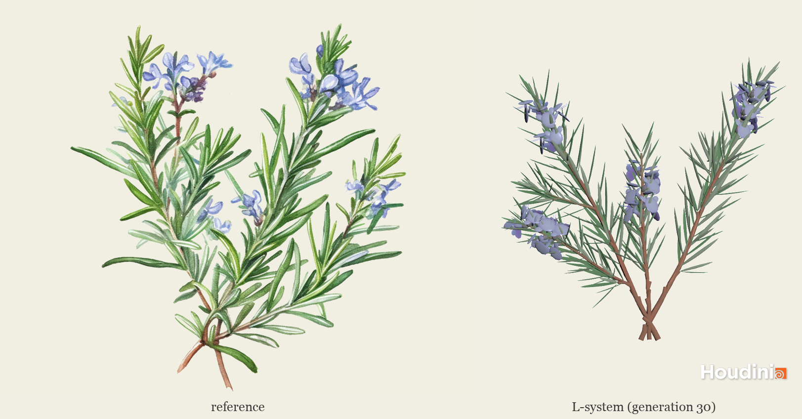
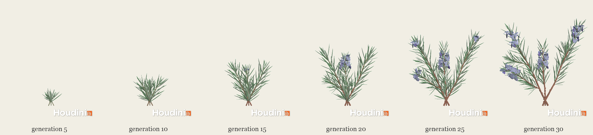
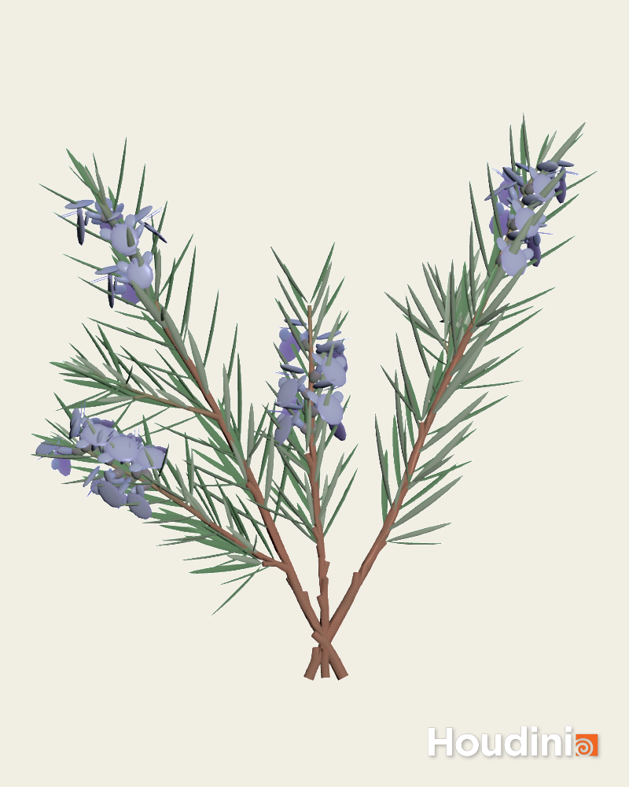

# lab05-grammars
Let's practice using grammars! For this lab, please pull up the L-system node in Houdini.

## 1. Wheat grammar puzzle
Look at these iterations (n = 1, 2, 3) of a one-rule grammar. Using the built in symbols in Houdini, design a grammar that produces this output. Take a screenshot of your rules.\


## 2. Square grammar puzzle
How about this one? Take a screenshot of your rules.\


## 3. Custom plant


Choose a plant in the world. Working off a reference, design a grammar that mimics the structure of that plant. Unlike our simple puzzles, please use multiple rules for greater complexity. Think carefully about the structure of your grammar! EXPLAIN the structure of your plant in the README. What are the components? What do each of the rules do? Be sure to also include images of a few iterations of your output plant. 

### My plant: Rosemary (*Salvia rosmarinus*)



#### Plant structure

These are the parts of the rosemary sprig in the reference. Each one maps to a symbol in the grammar.

- **Stems.** Three cut stems cross at the base and fan out into a V. Each stem is woody and reddish-brown low down and green near the tip. The bottom of each stem has no leaves, because the old leaves have fallen off.
- **Nodes and needle leaves.** The leaves are narrow needles that grow in opposite pairs. Each pair is rotated 90° from the pair below it (*decussate* arrangement). Young leaves near the tip are short and point straight up, forming a tight tuft. Older leaves are longer and spread out to about 40°.
- **Leaf tufts.** Many leaf axils hold a tiny shoot with a few small leaves. This is what makes rosemary look so dense.
- **Side shoots.** A few axillary buds grow into weaker side branches. These repeat the main stem's pattern at a smaller scale.
- **Flowers.** Pale blue flowers with two lips (a hood above, a broad lower lip below) grow in the upper leaf axils, just below the leafy tip.

#### How the grammar works

Most symbols are **developmental symbols** with parameters, such as an internode, a leaf or a flower bud, each with an age `n`. While the plant grows, every generation adds 1 to these ages. On the **last** generation, each symbol is replaced by turtle commands whose size, angle and colour depend on its age. This uses the L-system's iteration counter `t` together with the variable `b`, which is set to `ch("generations")`:

- Rules with the condition `t<b` describe growth and run on every generation except the last.
- Rules without that condition fire on the last generation and draw the plant.

As a result, older internodes are longer, thicker and browner. Young leaves are small and point upward, and the oldest leaves drop off.

| Symbol | Meaning |
| --- | --- |
| `A(k,v)` | Shoot apex. `k` = number of nodes made so far, `v` = vigour (1 for a main stem, 0.5 for a side shoot) |
| `I(n,v)` | Internode (stem segment) of age `n` |
| `L(n,v)` | Leaf of age `n` |
| `S` | Axillary leaf tuft |
| `B(d,v)` | Dormant bud that breaks in `d` generations |
| `W(n)` | Flower of age `n` |
| `J`, `K` | Stamp the needle leaf (input 1) or flower (input 2) geometry, scaled by the argument |

Each apex goes through three phases. With `c = 20`, a main stem (`v = 1`) makes:

1. 20 **vegetative** nodes,
2. then 6 **flowering** nodes,
3. then 3 nodes of a **leafy tip**,

and then it stops growing. A side shoot has `v = 0.5`, so it runs through the same phases with half as many vegetative nodes.

**Premise:** three stems from one cut base. Each one first steps sideways (`f`) and then leans back the other way, so the stems cross at the base. Their roll angles differ, so their leaf planes differ too.

```text
[+(90)f(0.04)-(90)-(24)/(20)A(0,1)] [-(90)f(0.04)+(90)+(20)/(110)A(0,1.05)] [-(4)/(200)A(0,0.62)]
```

**Rules:**

| # | Rule | What it does |
| --- | --- | --- |
| 1 | `A(k,v) : (t<b)*(k<c*v)*(k>3) = I(0,v)[L(0,v)][*L(0,v)][&(45)B(4,v)]/(90)~(4)A(k+1,v) : 0.15` | Vegetative node that also leaves a dormant bud (15% chance, never in the lowest nodes) |
| 2 | `A(k,v) : (t<b)*(k<c*v) = I(0,v)[L(0,v)][*L(0,v)][&(25)S]/(90)~(4)A(k+1,v) : 0.5` | Vegetative node with a leaf tuft in the axil (50% chance) |
| 3 | `A(k,v) : (t<b)*(k<c*v) = I(0,v)[L(0,v)][*L(0,v)]/(90)~(4)A(k+1,v)` | Plain vegetative node: internode, an opposite leaf pair (`*` rolls 180° for the second leaf), then `/(90)` for the decussate arrangement. `~(4)` adds slight irregularity |
| 4 | `A(k,v) : (t<b)*(k<c*v+6) = I(0,0.8*v)[L(0,0.75*v)][*L(0,0.75*v)][&(50)W(0)][*&(50)W(0)]/(90)~(6)A(k+1,v) : 0.5` | Flowering node with a flower in both leaf axils |
| 5 | `A(k,v) : (t<b)*(k<c*v+6) = I(0,0.8*v)[L(0,0.75*v)][*L(0,0.75*v)][&(50)W(0)]/(90)~(6)A(k+1,v)` | Flowering node with one flower |
| 6 | `A(k,v) : (t<b)*(k<c*v+9) = I(0,0.6*v)[L(0,0.6*v)][*L(0,0.6*v)]/(90)A(k+1,v)` | Leafy terminal tuft with shorter internodes and smaller leaves. After this phase no rule matches, so the apex stops |
| 7 | `S = I(0,0.2)[L(0,0.4)][*L(0,0.4)]/(90)[L(0,0.3)][*L(0,0.3)]` | Leaf tuft: a tiny stem with two small decussate leaf pairs |
| 8 | `B(d,v) : (t<b)*(d>0) = B(d-1,v)` | Bud stays dormant for `d` generations |
| 9 | `B(d,v) : (t<b)*(v>0.7) = A(0,0.5*v)` | Bud breaks into a side shoot with half the vigour. Only main stems branch, which gives two levels of branching |
| 10 | `I(n,v) : t<b = I(n+1,v)` | Internode ages |
| 11 | `I(n,v) = a("Cd",…)TF(0.048*(0.6+0.4*v)*min(0.4+0.2*n,1),(0.010+0.0006*n)*(0.6+0.4*v))` | Draws the internode. It reaches full length after 3 generations and keeps thickening with age. Its colour (`Cd`) shifts from green to woody brown over 12 generations, and `T` bends the shoot slightly upward |
| 12 | `L(n,v) : t<b = L(n+1,v)` | Leaf ages |
| 13 | `L(n,v) : n<22 = ^(10+10*min(n,3))~(6)J((0.10+0.05*min(n,3))*(0.6+0.4*v))` | Draws the leaf. Over its first 3 generations it grows from 0.10 to 0.25 and opens from 10° to 40° |
| 14 | `L(n,v) = f(0)` | Leaves older than 22 generations fall off, leaving a bare woody base |
| 15 | `W(n) : t<b = W(n+1)` | Flower ages |
| 16 | `W(n) = K(0.06+0.04*min(n,2))` | Draws the flower. The bud opens to full size over 2 generations |

The full colour expression in rule 11 is `a("Cd",0.40+0.14*min(n/12,1),0.50-0.24*min(n/12,1),0.28-0.10*min(n/12,1))`.

**L-system parameters:**

| Parameter | Value |
| --- | --- |
| Generations | 30 |
| `b` | `ch("generations")` |
| `c` | 20 |
| Gravity | −0.5 (makes `T` bend shoots upward) |
| Random Scale | 0.08 |
| Random Seed | 2 |
| Thickness | 1, so that `F`'s width argument is absolute |
| Type | Skeleton, with Point Attributes on |

Houdini syntax notes:

- `&&` doesn't work in rule conditions, so conditions are combined by multiplying them, as in `(t<b)*(k<c*v)`.
- When a rule with a probability doesn't fire, Houdini falls through to the next rule that matches. Rules 1→2→3 and 4→5 rely on this.

**Houdini network (`/obj/part3_rosemary`):**

- `leaf_needle` and `flower_lipped` are detail wrangles that build the leaf and flower geometry. These feed the L-system's `J` and `K` inputs.
- The needle points along +Y and has a dark green upper side and a pale underside.
- The flower has a calyx, a hood, a three-lobed lower lip and two stamens.
- `rosemary_lsystem` → `split_organs` separates the stems from the leaves and flowers using an `organ` attribute.
- `stem_tubes` (PolyWire) turns the stem curves into tubes, using the L-system's `width` attribute as the radius.
- `merge_plant` → `OUT_rosemary`.

#### Iterations

The same rules at generations 5, 10, 15, 20, 25 and 30, all framed the same:



Final result (generation 30):



## Submission
- Create a pull request against this repository
- In your readme, list your solutions and format your README nicely
- Profit
