# Lab 05: L-System Grammars

Built with Houdini's L-System SOP.

## 1. Wheat grammar puzzle

Premise `F`, rule `F=FF[-FF]F[-FF]FF-`, angle 20°. The trailing `-` turns each copy of the stalk 20° further than the last, so it curls into the spiral.

**Output** (n = 1, 2, 3):

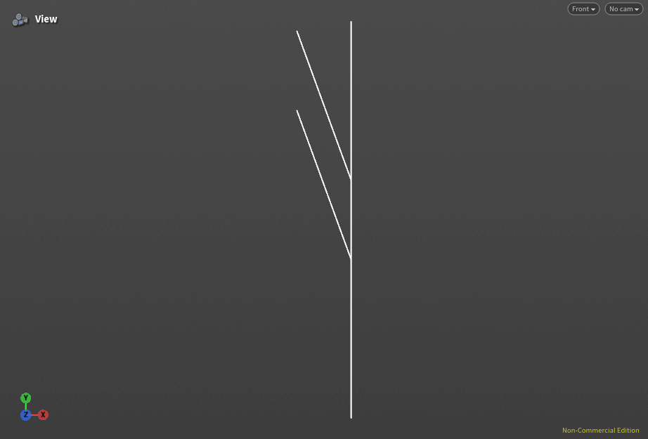 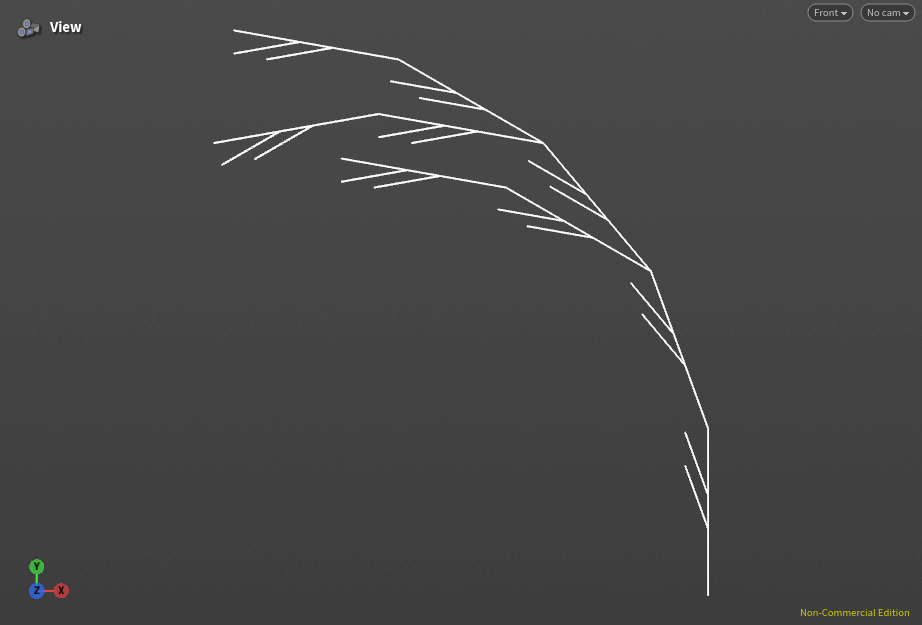 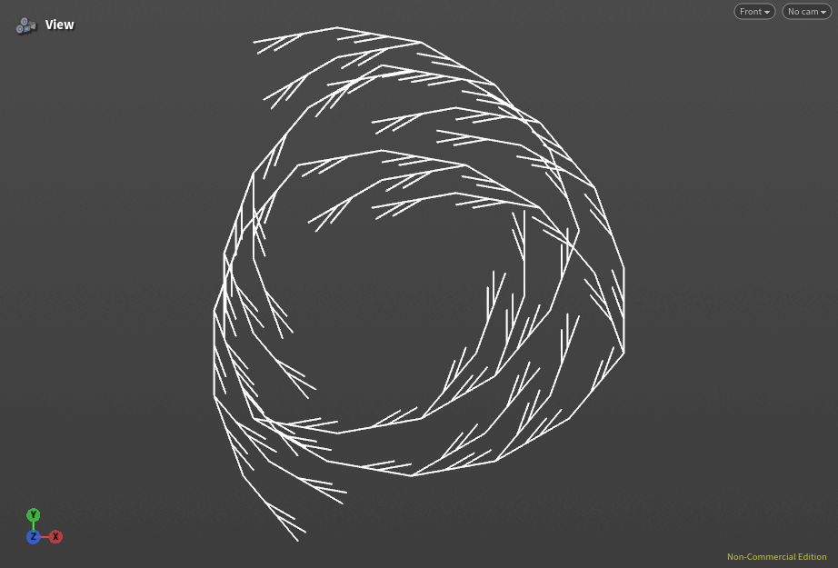

## 2. Square grammar puzzle

Premise `+F`, rule `F=F+F-F-F+F`, angle 90° (a quadratic Koch curve).

**Output** (n = 1, 2, 3):

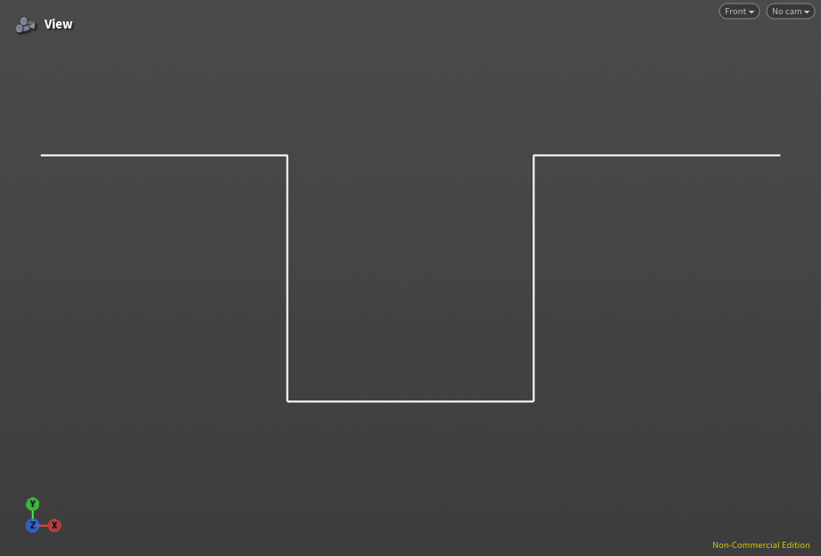 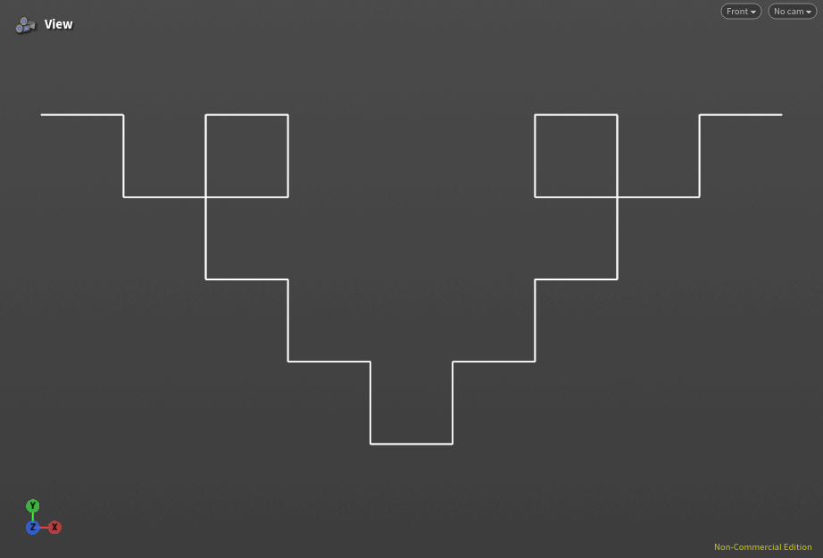 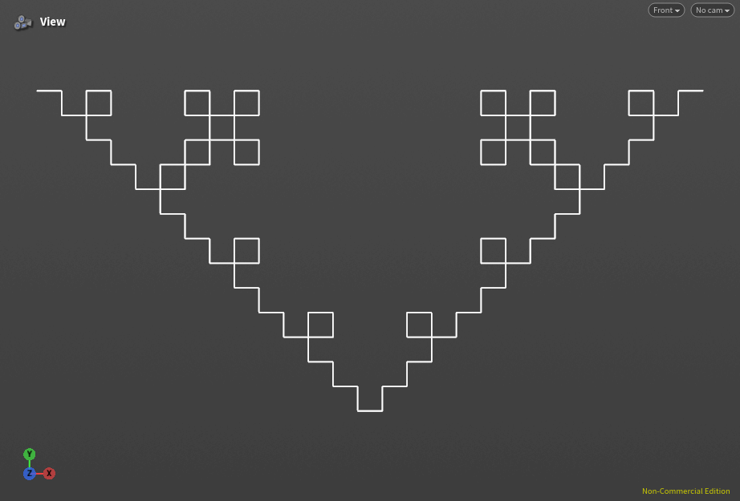

## 3. Custom plant: Norfolk Island pine

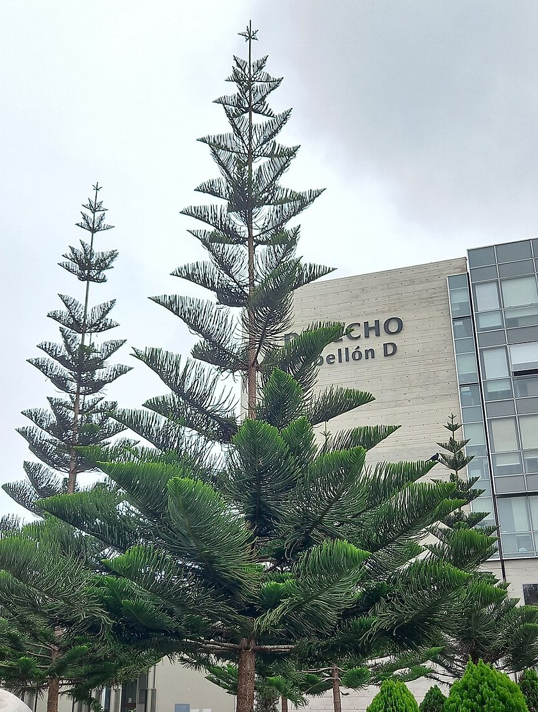 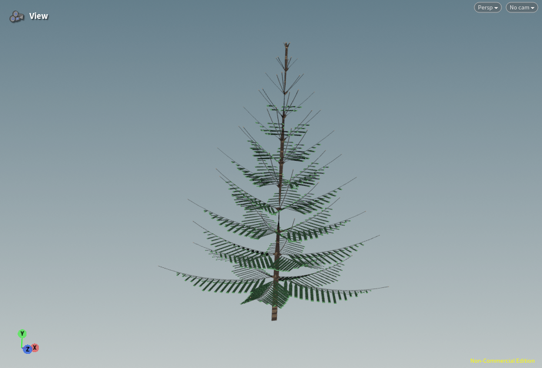

Reference photo: Alleter73, [Wikimedia Commons](https://commons.wikimedia.org/wiki/File:Araucaria_de_la_PUCP.jpg), CC0.

**Structure:** a single straight trunk with tiers (whorls) of 5 branches. Lower branches are older, so they're longer and sag toward horizontal with upturned tips, which gives the cone shape. Each branch carries flat sprays of needle covered branchlets.

Premise `FFA`, angle 38°, 12 generations.

| Rule | Component | What it does |
| :-- | :-- | :-- |
| `A=!(0.92)IW/(36)A` | Trunk apex | Adds a trunk segment and a whorl, rotates the next tier 36°, and tapers the trunk |
| `I=FF` | Trunk segment | Draws the trunk between tiers |
| `W=[!(0.3)S&HB]/(72)` ×5 | Whorl | Five branches 72° apart around the trunk |
| `S=;(1.1)S` | Sag | Multiplies a branch's angle by 1.1 each generation, so older branches droop |
| `B=!(0.9)HPHP^(3)B` | Branch | Grows the branch, adds branchlet pairs, and curves the tip upward |
| `P=[-(60)&(20)"(0.5)!(2.2)g(1)C(4)][+(60)&(20)"(0.5)!(2.2)g(1)C(4)]` | Branchlet pair | One branchlet on each side, grouped so they can be colored green |
| `C(n):n>0=FC(n-1)` | Branchlet | Grows up to 4 segments |

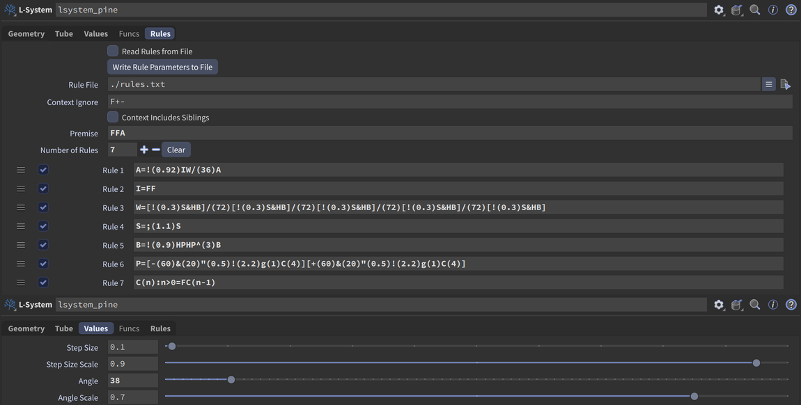

**Iterations** (generations 3, 6, 9, 12):

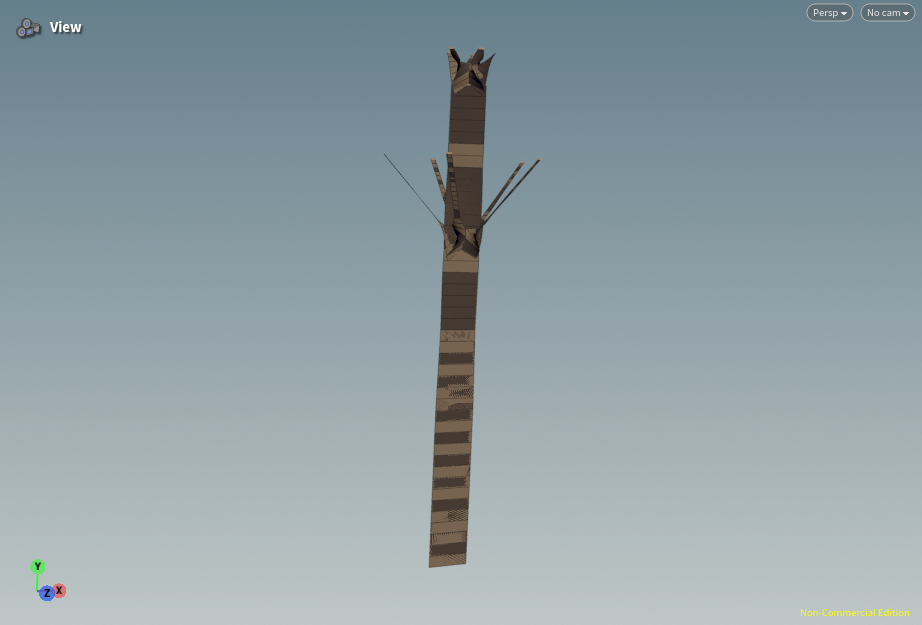 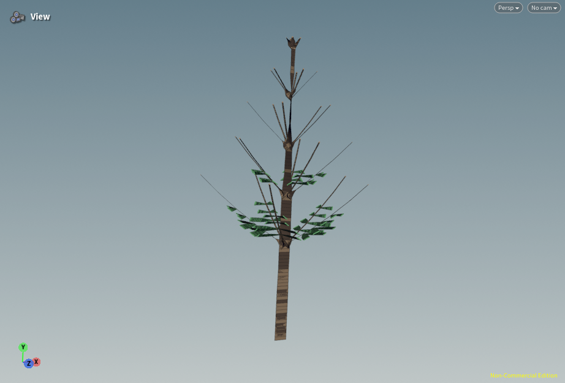 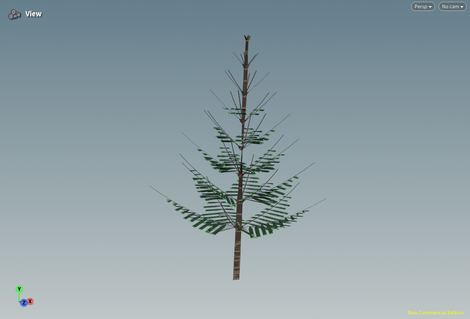 
